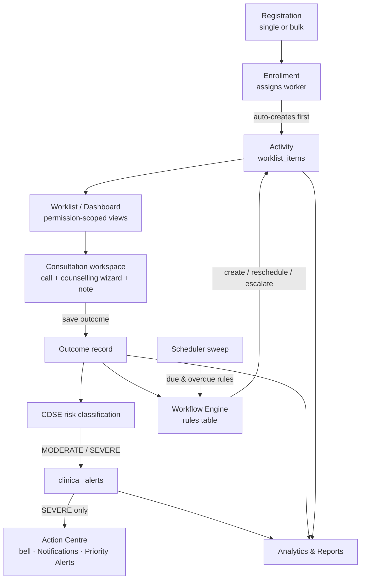

# DiNC Architecture

## System overview

Two-tier web application over PostgreSQL. The frontend never touches the
database; every capability is a REST endpoint under `/api`.

```mermaid
flowchart LR
    subgraph Client
        FE[Next.js 14 App Router\nfrontend/]
    end
    subgraph Server
        BE[NestJS 10 API\nbackend/ · /api prefix]
        SCHED[Scheduler\n@nestjs/schedule]
    end
    DB[(PostgreSQL\npublic schema)]

    FE -- "JSON + JWT (Bearer)" --> BE
    BE -- "pg pool (SQL, no ORM)" --> DB
    SCHED -- "due-activity sweep" --> BE
```

- **Auth**: `POST /api/auth/login` validates against `public.users`
  (bcrypt) and issues a JWT; `JwtAuthGuard` protects everything else.
  Role checks are enforced server-side per endpoint and mirrored client-side
  by `frontend/src/lib/permissions.ts` (ADMIN, CLINICIAN, ANM,
  CARE_ASSISTANT).
- **Data access**: hand-written SQL through a shared `pg` pool
  (`backend/src/database/`). Module tables are created idempotently
  (`CREATE TABLE IF NOT EXISTS`) by their owning repository.
- **Frontend**: fully client-rendered pages inside one authenticated layout
  (`app/(app)/layout.tsx`) that resolves the session once and provides
  `useUser()`/`can()` to every page. Heavy dependencies (xlsx, jspdf) are
  lazy-loaded on demand.

## Backend modules

| Module (`backend/src/`) | Responsibility |
|---|---|
| `auth` | Login, JWT, `/me`, password change, dev user switching |
| `users` | User & role administration (ADMIN) |
| `citizens` | Registry list/detail, bulk operations |
| `registration` | Registration options, duplicate check, single + bulk create |
| `enrollment` | Program → sub-program → disease → event catalogue; citizen enrollments; enrollment guidebook resolution |
| `activity` | Activities per enrollment; activity options; activity detail |
| `worklist` | Permission-scoped worklist overview; item → guidebook mapping |
| `consultation` | Consultation context, call lifecycle, notes (draft autosave), save-outcome pipeline, clinical journey, timeline |
| `cdse` | Risk classification from consultation responses; clinical alerts; goal recommendations |
| `care-plan` | Care plans: problems → goals → interventions, progress log, CDSE decisions |
| `workflow` | Workflow rules CRUD + the Workflow Engine executor |
| `scheduler` | Due-activity sweep, run log, manual trigger |
| `guidebooks` | Guidebook list/detail (live JSONB + protocol composition), import, bulk import, versions |
| `knowledge` | FAQs, training modules, emergency protocols, unified search |
| `dashboard` | Admin summary (stats, risk block, today's worklist), layout persistence |
| `analytics` | 11 report endpoints + shared filter options |
| `data-quality` | Duplicate report/review/merge/delete workflow |
| `system` | System settings summary |

## The clinical loop

The core product is one closed loop; each hop below is a module boundary.



### Workflow Engine (M28/M33)

Rules live in the `rules` table (seeded by `scripts/workflow_rules_seed.sql`,
editable in Administration → Workflow Rules). Each rule binds a trigger
(outcome saved, activity overdue) to an action — `COMPLETE_AND_ADVANCE`,
`CREATE_ACTIVITY`, `RESCHEDULE_ACTIVITY`, `CREATE_REFERRAL`, escalation and
notification actions — with optional delay, priority, and role targets.
Execution happens synchronously on consultation save and asynchronously via
the scheduler sweep; escalations create a SEVERE alert plus an URGENT
follow-up activity.

### CDSE (M25/M25A)

Consultation answers are persisted as structured `consultation_responses`
keyed by the immutable authored item identity `item_key` (`CI_XXXXXX`).
Category mappings (`scripts/milestone25_cdse_categories.sql`) classify
responses into NONE/LOW/MODERATE/SEVERE; MODERATE and SEVERE write
`clinical_alerts`. The Action Centre surfaces **SEVERE only** (one SQL
predicate — see `cdse.repository.ts`); moderate risk surfaces through
Dashboard risk KPIs and Reports instead. CDSE also produces goal suggestions
consumed by the care-plan module.

### Guidebooks (data-driven)

A guidebook's detail is composed live at read time: JSONB content sections
merged with the counselling protocol sections for its disease — nothing is
copied, so protocol edits appear immediately. Import paths (JSON single,
CSV/Excel/JSON bulk) validate client-side, then create versioned records
(`guidebook_versions`). The consultation workspace opts out of this
composition and reads protocols directly.

### Dashboard & Worklist scoping (M31)

Without `worklist.view.all` / `dashboard.view.all` (non-ADMIN roles), the
backend restricts items to the requesting user via
`enrollments.assigned_worker` — scoping is a server-side WHERE clause, not a
frontend filter.

## Frontend structure

```
frontend/src/
├── app/(app)/            # authenticated pages (dashboard, worklist, citizens, …)
├── app/page.tsx          # login
├── components/<module>/  # feature components (citizens, consultation, guidebooks, …)
├── components/workspace/ # M27 fixed-viewport primitives (Workspace, Panel, KpiRibbon)
├── components/shell/     # AppShell, Sidebar, TopBar, Skeleton
└── lib/                  # api.ts (all fetchers), session, permissions, format, useDialogA11y
```

Conventions worth knowing:

- **One API client**: every request goes through a typed fetcher in
  `lib/api.ts`; components never call `fetch` directly.
- **M27 workspace pages** (Dashboard, Citizens, Users) are fixed-viewport —
  panels scroll internally, the page never scrolls; other pages use the
  classic scrolling `page` layout.
- **Dialog accessibility** is centralized in `lib/useDialogA11y.ts` (Escape,
  focus trap, focus restore) — every modal uses it.
- **Toasts** use `cz-toast` (+ `cz-toast--err`), `role="status"`, timer refs
  with cleanup; success 2600 ms, errors 4200 ms.
- **UHID-only identity on the Dashboard** — patient names are never rendered
  there (PII decision).
