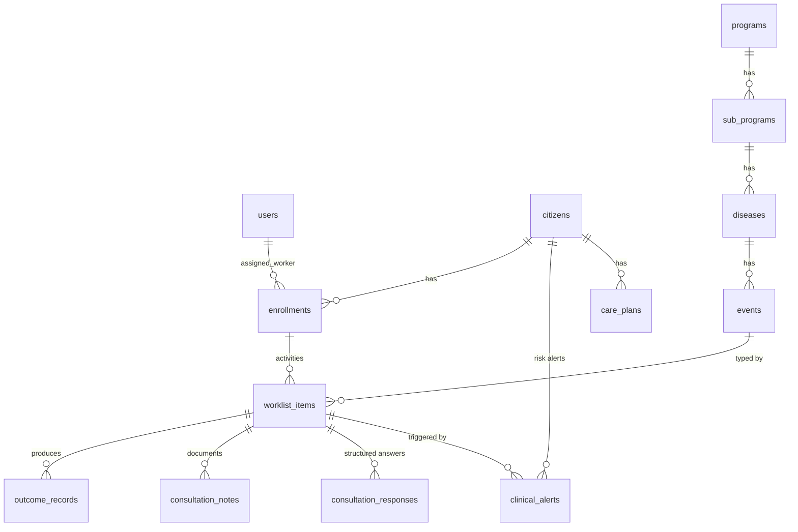

# DiNC Database Guide

Single PostgreSQL database, `public` schema, accessed with plain SQL through
one `pg` pool. Two kinds of tables:

- **Base schema** — pre-existing operational tables (citizens, users,
  program catalogue, worklist). Provisioned with the database.
- **Module tables** — created idempotently by the owning backend repository
  (`CREATE TABLE IF NOT EXISTS`) and/or seeded from `scripts/`.

This is a developer orientation, not a column-by-column reference — read the
owning repository in `backend/src/<module>/` for exact definitions.

## Core entities

| Table | Role |
|---|---|
| `users` | Accounts + bcrypt `password_hash` + `role` (ADMIN / CLINICIAN / ANM / CARE_ASSISTANT) |
| `citizens` | Patient registry (UHID, demographics, contact) |
| `programs` → `sub_programs` → `diseases` → `events` | Four-level clinical program catalogue; events type the activities |
| `enrollments` | Citizen ↔ program instance; `assigned_worker` drives all worklist/dashboard scoping (M31) |
| `worklist_items` | Activities: due date, status (PENDING / IN_PROGRESS / COMPLETED / ESCALATED), priority, reminders |

## Consultation & counselling

| Table | Role |
|---|---|
| `counselling_protocols` / `counselling_sections` / `counselling_items` | 16E normalized counselling model (seeded: 15 protocols, 101 sections, 424 items). Items carry the immutable identity `item_key` (`CI_XXXXXX`) |
| `consultation_notes` | Draft/final documentation per activity (draft autosave) |
| `consultation_responses` | Structured per-item answers keyed by `item_key` — the CDSE input |
| `contact_outcomes`, `outcome_types`, `outcome_templates`, `outcome_records` | Outcome catalogue + per-consultation outcome facts |

## CDSE & alerts

| Table | Role |
|---|---|
| `clinical_alerts` | One row per MODERATE/SEVERE classification: `citizen_id`, `activity_id`, `disease`, `risk_level` (CHECK: MODERATE/SEVERE), `status` ACTIVE/RESOLVED. The Action Centre reads `status='ACTIVE' AND risk_level='SEVERE'` — that predicate is the single source of truth for the bell count, Notifications page, and Priority Alerts |
| CDSE category mappings | Seeded by `scripts/milestone25_cdse_categories.sql`; map counselling responses to risk levels |

## Workflow & scheduling

| Table | Role |
|---|---|
| `rules` | Workflow rules: trigger + action (`CREATE_ACTIVITY`, `COMPLETE_AND_ADVANCE`, `RESCHEDULE_ACTIVITY`, `CREATE_REFERRAL`, escalate/notify) + delay/priority/role parameters. Seeded by `scripts/workflow_rules_seed.sql`, editable in Administration |
| `retry_config` | Retry/reminder parameters consumed by the engine |
| `scheduler_runs` | Run log for the due-activity sweep (due found, rules processed, escalations) |
| `notifications` | Notification records produced by workflow actions |

## Care plans

`care_plans` → `care_plan_problems` → `care_plan_goals` →
`care_plan_interventions`, plus `care_plan_progress` (append-only log) and
`cdse_recommendation_decisions` (accept/reject audit of CDSE goal
suggestions).

## Guidebooks & knowledge

| Table | Role |
|---|---|
| `guidebooks` | Guidebook records with JSONB content sections; detail responses are composed live with counselling protocol sections (no copying) |
| `guidebook_versions` | Append-only version history (BASELINE, IMPORTED, …) |
| `faqs`, `training_modules` | Knowledge Hub content (FAQs admin-editable) |

## Operations

| Table | Role |
|---|---|
| `duplicate_requests` | Data-quality workflow: report → review (approve/reject) → resolve (MERGE/DELETE), with reference codes |
| `dashboard_layouts` | Per-role Dashboard Studio layouts (empty layout = registry defaults) |

## Analytics data sources

The `analytics` module has **no tables of its own** — every report aggregates
the operational tables above at query time: `worklist_items` + `enrollments`
(operations, worklist, workers), `citizens` + `enrollments` (registrations,
programs, diseases), `clinical_alerts` (risk), `outcome_records` (workflow,
executive), `scheduler_runs` (scheduler), `faqs`/`training_modules`/`guidebooks`
(knowledge), `duplicate_requests` (data quality). Reports therefore always
agree with the live screens because they read the same rows.
