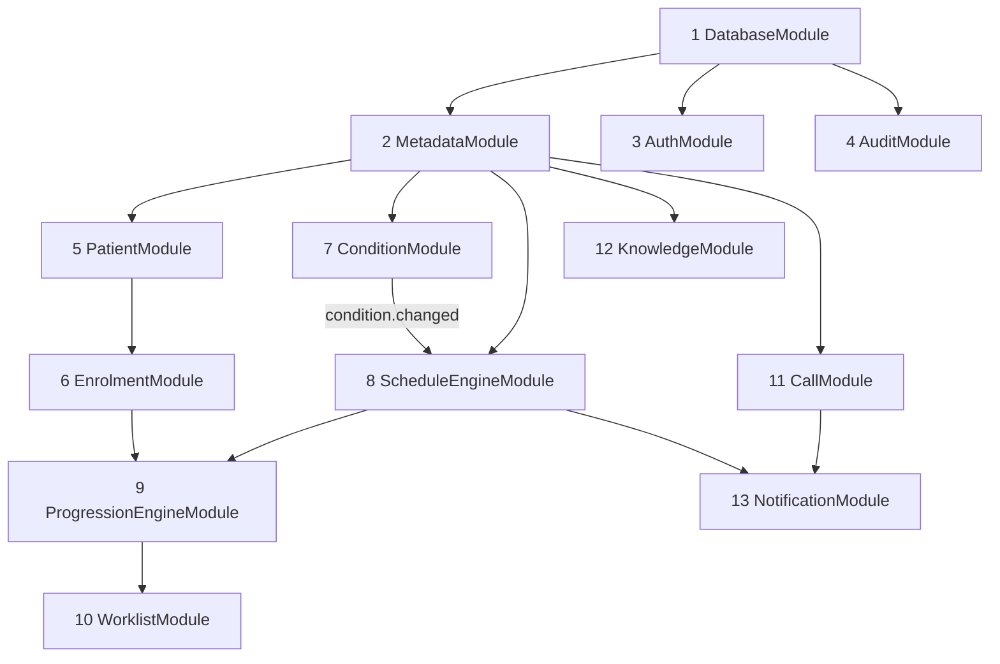

# DiNC Backend Architecture Document (NestJS)

**Approved inputs (all FINAL, none modified):** `DiNC_Metadata_Master_v1.8.xlsx` · `DiNC_PostgreSQL_Database_Design.md` · `postgresql_v1.8/` SQL implementation · `PRODUCTION_READINESS_REPORT.md`
**Status:** implementation blueprint. **No code, no API specs, no database changes.**

**Foundational rule the whole backend inherits:** the database already enforces the architecture — `dinc_metadata` is SELECT-only to the app role, resolution logic lives in resolver views, invariants live in constraints, and the audit trail is append-only. The backend therefore *never re-implements* precedence, invariants, or timeline math that the database already owns; it orchestrates state transitions and reads canonical resolutions.

**Stack assumptions (recommendation, not code):** NestJS 10 · `pg` connection pool connected **as `dinc_app`** (so the privilege boundary applies to the backend itself) · thin typed repository classes over SQL and the resolver views (an ORM adds little here: metadata is read-only views, runtime is short transactional writes) · `@nestjs/schedule` for jobs · Nest `EventEmitter2` for domain events · `class-validator` DTOs.

---

## 1. Module Map (13 modules)

| # | Module | Controllers | Services | Repositories | DTOs (main) | Guards / Interceptors | Jobs |
|---|---|---|---|---|---|---|---|
| 1 | **DatabaseModule** (global) | — | `PgPoolService` (dinc_app pool, tx helper) | — | — | — | — |
| 2 | **MetadataModule** (global, read-only) | `MetadataController` (reference data for UI) | `MetadataService` (release-keyed in-memory cache), `MetadataReleaseGuardService` (boot check vs `metadata_release`) | `ProgrammeRepo`, `EventRepo`, `ActivityRepo`, `ScheduleRuleRepo` (reads `v_schedule_rule_effective`), `OutcomeTemplateRepo`, `EnumRepo` | `ProgrammeDto`, `EventDto`, `ActivityDto`, `OutcomeTemplateDto` | — | — |
| 3 | **AuthModule** (`dinc_security`) | `AuthController` | `AuthService`, `UserService` | `AppUserRepo` | `LoginDto`, `UserDto` | `JwtAuthGuard`, `RolesGuard` (CARE_MANAGER / SUPERVISOR / ADMIN) | — |
| 4 | **AuditModule** (`dinc_audit`) | — | `AuditService` (INSERT-only writer) | `AuditLogRepo` | — | `AuditInterceptor` (global: mutating requests → audit_log rows) | — |
| 5 | **PatientModule** | `PatientController` | `PatientService` | `PatientRepo` | `CreatePatientDto`, `UpdatePatientDto`, `PatientSearchDto` | — | — |
| 6 | **EnrolmentModule** | `EnrolmentController` | `EnrolmentService` (enrol → first-event activation via ProgressionEngine; exit → BD-7 semantics) | `EnrolmentRepo` | `EnrolPatientDto`, `ExitProgrammeDto` | — | — |
| 7 | **ConditionModule** | `ConditionController` | `ConditionService` (flag/clear; emits `condition.changed`) | `PatientConditionRepo` | `FlagConditionDto`, `ClearConditionDto` | — | — |
| 8 | **ScheduleEngineModule** | — (internal engine, no controller) | `ScheduleEngineService`, `RecurrenceService` | `EventInstanceRepo` (shared w/ #9 via exports) | — | — | `RecurrenceSweepJob` (nightly safety net) |
| 9 | **ProgressionEngineModule** | `OutcomeController` (record outcome responses) | `ProgressionService` (workflow_action dispatch), `OutcomeResponseService` | `ActivityInstanceRepo`, `OutcomeResponseRepo` | `RecordOutcomeDto` | — | — |
| 10 | **WorklistModule** | `WorklistController` | `WorklistService` (Worklist Engine, §6) | reads via #8/#9 repos + `FollowupTaskRepo` | `WorklistQueryDto`, `WorklistItemDto` | — | — |
| 11 | **CallModule** | `CallController` | `CallLogService`, `CallOutcomeResolverService` (§8), `FollowupTaskService` | `CallLogRepo`, `FollowupTaskRepo` | `LogCallDto`, `FollowupTaskDto`, `ReassignTaskDto` | — | `FollowupEscalationJob` (optional, overdue OPEN tasks) |
| 12 | **KnowledgeModule** | `KnowledgeController` | `GuidebookResolverService` (§7), `FaqService`, `NutritionAdviceService`, `TrainingModuleService` | `GuidebookRepo` (+ placement/discovery views), `FaqRepo`, `NutritionRepo`, `TrainingRepo` | `KnowledgePanelDto`, `GuidebookSearchDto` | — | — |
| 13 | **NotificationModule** | — | `NotificationService` (compose from due dates / follow-ups) | `NotificationRepo` | — | — | `NotificationDispatcherJob` (poll SCHEDULED ≤ now, send, mark SENT/FAILED) |

Cross-cutting (registered globally in `AppModule`): `ValidationPipe` (DTOs), `AuditInterceptor`, `JwtAuthGuard` default-on with public exceptions, a `TransactionHelper` in DatabaseModule so multi-table state transitions (§5/§8) run in single transactions.

**Deliberately absent:** no "OverdueService" and no overdue job — Overdue is *derived* (`now > due_date AND status <> COMPLETED`) per the approved design; it is computed in worklist queries, never stored. No metadata-writing service exists anywhere: the pool user cannot write `dinc_metadata`, so a bug cannot either.

---

## 2. Module Dependency Order

Boot/dependency sequence (each layer depends only on layers above it):

Import order: Database → Metadata → Auth/Audit → Patient → Condition → Enrolment → ScheduleEngine → ProgressionEngine → Worklist / Call / Knowledge → Notification.

Two intentional decouplings prevent cycles: (a) ScheduleEngine and ProgressionEngine communicate through **domain events**, not mutual imports — Progression emits `event.completed`; ScheduleEngine listens and activates successors (and stops HRP recurrence); (b) ConditionModule never imports ScheduleEngine — it emits `condition.changed`, ScheduleEngine listens (README §10 step 6 re-resolution).

Domain events: `condition.changed` · `activity.completed` · `event.completed` · `enrolment.created` · `enrolment.exited` · `call.logged`.

---

## 3. Metadata vs Runtime Dependency of Each Module

| Module | dinc_metadata (read-only) | dinc_runtime (read/write) | Other |
|---|---|---|---|
| MetadataModule | all 21 tables + 7 resolver views | — | — |
| AuthModule | — | — | dinc_security |
| AuditModule | — | — | dinc_audit (INSERT only) |
| PatientModule | — | patient | — |
| ConditionModule | enum_reference (vocabulary check is also DB-enforced) | patient_condition | — |
| EnrolmentModule | programme | programme_enrolment | — |
| ScheduleEngineModule | `v_schedule_rule_effective`, schedule_rule, event | event_instance | — |
| ProgressionEngineModule | activity, outcome_template(_field) — reads `workflow_action` | activity_instance, outcome_response, event_instance | — |
| WorklistModule | event, activity, programme (labels) | event_instance, activity_instance, followup_task | — |
| CallModule | `v_event_call_outcome_resolved`, `v_call_outcome_rule_resolved`, call_outcome | call_log, followup_task | — |
| KnowledgeModule | the 4 `v_*_placement` views, guidebook_section, guidebook_discovery_rule | — (reads enrolment context only) | — |
| NotificationModule | — | notification (+ reads event_instance, followup_task) | — |

Pattern: **engine modules read metadata and write runtime; UI-facing modules mostly read runtime and label from metadata; nothing writes metadata.**

---

## 4. Metadata caching policy

Metadata is frozen per release, so `MetadataService` caches all metadata tables and view results in memory at boot, keyed by `metadata_release.release_version + workbook_sha256`. On boot, `MetadataReleaseGuardService` verifies exactly one expected release row exists (fail fast on mismatch — the backend refuses to start against the wrong metadata release). Cache invalidation = process restart after a release migration; there is deliberately no runtime refresh path.

---

## 5. Schedule Engine (ScheduleEngineService) — design

The engine's only writes are to `event_instance`. All resolution comes from `v_schedule_rule_effective` (the database owns coalesce precedence).

**5.1 Effective-rule resolution** — for (enrolment, event): collect the enrolment's LIVE condition codes from `patient_condition` (cleared_at IS NULL); select the view row where `condition_context` matches a live condition, else the `condition_context IS NULL` (BASE) row. v1.8 guarantees at most one override match; if multiple ever match, raise — precedence is a metadata decision, not an engine guess.

**5.2 Activation** (on `event.completed` of a predecessor, or `enrolment.created` for dependency-less events per BD-4): an event activates when its **dependency is satisfied AND its existence condition (`condition_code` on the base rule) is satisfied — whichever happens later** (README §11). ConditionModule's `condition.changed` event re-runs activation checks so a flag set days after ANC 1 correctly activates EVT-005/EVT-006 at flag time.

**5.3 Due-date computation** — anchor per `anchor_type`: `registration_date` (enrolment), predecessor `completed_at`, or `patient.birth_date` (BD-2: refuse activation with a domain error if birth_date is missing for a BIRTH_DATE-anchored event). `due_date = anchor + effective offset_days`; `offset_days NULL` (EVT-005 campaign-calendar; EVT-038/040 on-referral) ⇒ no computed due date — instance is workable but never Overdue. Write `condition_context` onto the instance to record which variant priced it.

**5.4 Recurrence (RecurrenceService)** — occurrence n is `event_instance` with `occurrence_number = n` (unique constraint makes duplicates impossible). Generation is **lazy**: completing occurrence n creates n+1 due `completed_at + repeat_interval_days`, unless any stop condition holds: `repeat_count` exhausted · **`repeat_until_event_code` event COMPLETED in this enrolment** (HRP stops at Delivery — checked on both occurrence-completion and `event.completed` of the terminator, which also cancels an already-open next occurrence) · enrolment exited. `RecurrenceSweepJob` (nightly) is a safety net that materialises any occurrence the event-driven path missed (e.g. after downtime).

**5.5 Re-resolution** (on `condition.changed`) — recompute due dates of ACTIVE/LOCKED (not COMPLETED) instances in the affected enrolment with the new effective rule; update `condition_context`; emit nothing (worklist reads see it immediately). Completed instances are never revised — the same rule the design document fixed.

## 6. Worklist Engine (WorklistService) — design

Read-only composition over the three indexed hot paths; no state of its own.

- **Sources:** (a) ACTIVE `event_instance` + their PENDING `activity_instance` (via `ix_ei_status_due`, `ix_ai_pending`); (b) OPEN `followup_task` for the care manager (via `ix_ft_assigned_status_due`).
- **Overdue is computed in the query** (`due_date < today`), never stored — one source of truth for the flag, zero update anomalies.
- **Ordering:** overdue first (oldest due_date first), then due-today, then upcoming; follow-ups interleaved by (priority URGENT>HIGH>NORMAL, due_date). Pagination mandatory.
- **Labels** (event/activity/programme names) come from the metadata cache — no joins to metadata at request time beyond what the DB does cheaply; the worklist item DTO carries codes + display names + derived flags (`isOverdue`, `daysOverdue`, `conditionContext` so the UI can badge HIGH_RISK items).
- **Scope rules:** care manager sees assigned patients (assignment lives with AuthModule/`app_user`); supervisors see cohort roll-ups (counts by programme/status from `ix_enrolment_prog_status`).

## 7. Guidebook Resolver (GuidebookResolverService) — design

Two resolution paths, kept separate exactly as the metadata separates them:

- **Placement (structural):** "what shows for this patient" = `v_guidebook_placement WHERE programme_code = enrolment's programme`, ordered by `display_order` — the view already merges PROGRAMME + GLOBAL scope. Bodies come from `guidebook_section` ordered by `display_order` (SUMMARY / KEY_STEPS / ESCALATION). Served from the metadata cache.
- **Discovery (textual):** free-text query → evaluate active `guidebook_discovery_rule` patterns (case-insensitive regex, compiled once at boot into the cache) in `sort_order` precedence; return matched guidebooks ranked by rule order, deduplicated, filtered to the patient's placement set *plus* GLOBAL (a discovery hit outside the patient's programme is shown flagged as "other programme" rather than hidden — clinical safety over strict scoping; this is a UI policy the service parameterises).
- FAQ / Nutrition / Training follow the placement path only, via their `v_*_placement` views; same service shape, no discovery rules exist for them in v1.8.

## 8. Call Outcome Resolver (CallOutcomeResolverService) — design

One transaction per logged call (TransactionHelper):

1. **Offered outcomes** for the current event = `v_event_call_outcome_resolved WHERE event_code = …` (DB owns specific-overrides-ALL). Reject a disposition not in the offered set.
2. Insert `call_log` (enrolment, optional event_instance, outcome_code, called_by).
3. **Consequence** = `v_call_outcome_rule_resolved WHERE programme_code = enrolment's programme AND outcome_code = disposition`:
   - `FOLLOW_PROGRAM_SCHEDULE` → nothing else; the Schedule_Rule timeline stays in force.
   - `CREATE_FOLLOWUP` → insert `followup_task` with `due_date = called_at::date + followup_delay_days` and the resolved `priority` — **values read at creation time and stored as facts** (retuning metadata later never rewrites existing tasks); `call_log_id` UNIQUE gives the 1:0..1.
4. Emit `call.logged`; NotificationModule may schedule a reminder against the task. A follow-up task never blocks progression (BD-9 as shaped in the approved design).

---

## 9. Scheduled jobs summary

| Job | Module | Cadence | Work |
|---|---|---|---|
| `NotificationDispatcherJob` | Notification | every minute | send SCHEDULED notifications with `scheduled_for <= now` via `ix_nt_status_scheduled`; mark SENT/FAILED with detail |
| `RecurrenceSweepJob` | ScheduleEngine | nightly | materialise missed recurrence occurrences (safety net; §5.4) |
| `FollowupEscalationJob` (optional) | Call | daily | notify supervisors of OPEN tasks past due_date |

Jobs are idempotent and lease-guarded (`FOR UPDATE SKIP LOCKED` pattern) so multiple backend instances never double-send or double-materialise.

## 10. Open business decisions the backend must not pre-empt

BD-3/BD-4 (progression topology & activation of the 38 dependency-less events — §5.2 implements the recommended reading but the toggle sits in one place: `ScheduleEngineService.activationPolicy`) · BD-6 ("Not Completed" persistence — `OutcomeResponseService` records attempts by default, matching the design recommendation) · BD-7 (exit semantics — `EnrolmentService.exit` freezes in-flight instances pending confirmation) · BD-9 (follow-up task nature — implemented as non-blocking worklist items as designed). Each is isolated behind a single service so a business decision changes one class, not the architecture.

---

*Blueprint only: no NestJS code, no API definitions, no database changes. Every table, view, and index referenced above exists verbatim in the deployed-and-audited `postgresql_v1.8/` implementation.*
