# DiNC PostgreSQL Database Design Document

**Sources of truth:** `DiNC_Metadata_Master_v1.8.xlsx` (FINAL frozen metadata) · `DiNC_PostgreSQL_Implementation_Blueprint.md`
**Status:** Logical database design for approval. **No SQL, no DDL, no workbook changes.**
**Grounding:** every nullability, key, and uniqueness statement below was programmatically profiled from the v1.8 workbook data, not assumed.

**Global conventions** (apply to every table; not repeated per table):
- Table/column names: `snake_case`, singular table names, exactly the workbook's column names.
- Metadata PKs are the workbook's **deterministic UUIDv5** values — reproducible, stable, no generators. Runtime PKs are database-generated UUIDs.
- Logical types only: `uuid`, `text`, `integer`, `boolean`, `timestamptz`, `date`. Physical sizing/DDL is the next phase.
- **NULL is semantic** in configuration tables (open-ended, unconditional, no-offset, no-terminator). NOT NULL is applied only where the workbook data is 100% populated *and* the meaning requires a value.
- Enum-governed columns (`schedule_type`, `anchor_type`, `condition_code`, `workflow_action`, `next_action`, `priority`, `scope_level`) are enforced by **lookup against `enum_reference`** rather than hardcoded CHECK lists — drift-resistant and extensible by data (Audit D2-2).
- Metadata tables are tiny (12–193 rows). Indexes there exist to **back constraints and FK lookups**, not for performance; PostgreSQL will seq-scan them regardless. Performance indexing effort belongs in runtime tables (§Task 2).

---

# TASK 1 — Metadata Table Designs (21 tables)

### 1. `programme` — Metadata
| Aspect | Design | Reasoning |
|---|---|---|
| PK | `programme_id` (uuid) | Deterministic UUIDv5; stable machine key |
| Candidate keys | `programme_code`, `programme_name` | Both unique in data; code is the natural key used by FK-or-sentinel columns |
| Unique | `programme_code`; `programme_name` | Prevents duplicate programmes; code is referenced by `call_outcome_rule` and mapping `scope_code` |
| FKs | — | Hierarchy root |
| Indexes | PK + the two unique indexes | Nothing more needed at 12 rows |
| Checks | `display_order > 0` | Orders are 1-based positions |
| NOT NULL | all 4 columns | 100% populated; every column is definitional |

### 2. `event` — Metadata
| Aspect | Design | Reasoning |
|---|---|---|
| PK | `event_id` (uuid) | |
| Candidate keys | `event_code`; (`programme_id`, `event_name`) | `event_code` globally unique; names unique only within a programme (README states this scope) |
| Unique | `event_code`; (`programme_id`, `event_name`) | |
| FKs | `programme_id → programme` | The only parent |
| Indexes | PK, uniques, + FK index on `programme_id` | FK index supports programme→events expansion |
| Checks | `display_order > 0` | |
| NOT NULL | all 5 columns | 100% populated, all definitional |

### 3. `activity` — Metadata
| Aspect | Design | Reasoning |
|---|---|---|
| PK | `activity_id` (uuid) | |
| Candidate keys | `activity_code`; (`event_id`, `activity_name`) | Same names legitimately recur under different events (README §4) — uniqueness is per-event, never global |
| Unique | `activity_code`; (`event_id`, `activity_name`) | |
| FKs | `event_id → event` | Deliberately **no** `programme_id` — would be transitive (3NF, README §4) |
| Indexes | PK, uniques, FK index on `event_id` | |
| Checks | `display_order > 0` | |
| NOT NULL | all 5 columns | |

### 4. `schedule_rule` — Configuration
| Aspect | Design | Reasoning |
|---|---|---|
| PK | `rule_id` (uuid) | |
| Candidate keys | `event_id`; `event_code` | Each is 1:1 with the rule — the audited invariant |
| Unique | `event_id`; `event_code` | **These uniques ARE the "exactly one rule per Event" invariant** — enforced structurally, not by convention |
| FKs | `event_id → event`; `dependency_event_code → event.event_code`; `repeat_until_event_code → event.event_code`; enum lookups for `schedule_type`, `anchor_type`, `condition_code` | Dual-key convention: `event_id` is the enforced FK, `event_code` a validated natural key (Design Review §F); the two code-FKs are the start gate and stop gate |
| Indexes | PK, uniques, indexes on `dependency_event_code`, `repeat_until_event_code` | The engine queries "which events depend on the one just completed" and "which recurrences stop at this event" — both are lookups by these columns |
| Checks | `schedule_type = RECURRING ⇒ repeat_interval_days NOT NULL` · `schedule_type = SCHEDULE_DRIVEN ⇒ reference_source NOT NULL` · `anchor_type = PREVIOUS_EVENT_COMPLETION ⇒ dependency_event_code NOT NULL` · `offset_days ≥ 0` · `repeat_interval_days > 0` · `repeat_count > 0` · `repeat_until_event_code ≠ event_code` | Exactly the invariants the workbook audit verified (Design Review §A-8), plus non-self-termination; encoding them as constraints makes the audit permanent |
| NOT NULL | `rule_id`, `event_code`, `event_id`, `schedule_type`, `anchor_type` | 100% populated |
| Nullable | `offset_days` (3 null: EVT-005 campaign-calendar, EVT-038/040 on-referral), `repeat_interval_days` (27), `repeat_count` (31 — null = open-ended), `repeat_until_event_code` (64 — only EVT-006), `dependency_event_code` (38 — independent streams), `condition_code` (27 — null = unconditional), `reference_source` (46), `rule_description` (55) | Every NULL carries documented meaning — **no NOT NULL defaults may be added** (Design Review §F) |
| Cross-table validation | (`event_code`,`event_id`) pair-consistency | Belongs in the seed validator (trigger would be redundant for read-only data) |

### 5. `schedule_rule_override` — Configuration
| Aspect | Design | Reasoning |
|---|---|---|
| PK | `override_id` (uuid) | |
| Candidate key | (`event_code`, `condition_code`) | One override per event per condition — the v1.8 design rule |
| Unique | (`event_code`, `condition_code`); also (`event_id`, `condition_code`) | Both spellings of the same rule; keeps either join path safe |
| FKs | `event_id → event`; **`event_id → schedule_rule.event_id`** (explicit "override needs a base rule"); `repeat_until_event_code → event.event_code`; enum lookup for `condition_code` | The base-rule FK is implied by the 1:1 in the workbook; making it explicit costs nothing and makes orphan overrides impossible (see Task 6) |
| Indexes | PK, uniques | 3 rows; resolver lookup is by (`event`, `condition`) = the unique index |
| Checks | `condition_code NOT NULL` · at least one of the four timing columns NOT NULL · `offset_days ≥ 0`, `repeat_interval_days > 0`, `repeat_count > 0` | An override without a condition or without any delta is meaningless (README §8) |
| NOT NULL | `override_id`, `event_code`, `event_id`, `condition_code`, `is_active` | |
| Nullable | the four timing columns (null = inherit base), `rule_description` | Coalesce semantics require nullability |

### 6. `outcome_template` — Metadata
| Aspect | Design | Reasoning |
|---|---|---|
| PK | `template_id` (uuid) | |
| Candidate keys | `activity_id`; `activity_code` | 1:1 with Activity in v1 |
| Unique | `activity_id`; `activity_code` | Enforces the one-template-per-activity rule structurally |
| FKs | `activity_id → activity` | |
| Indexes | PK + uniques | |
| Checks | `display_order > 0` | |
| NOT NULL | all 6 columns | 100% populated |
| Note | `activity_code`, `activity_name` are **deliberate, non-authoritative denormalized copies** (Design Review §H-3). Keep them to mirror the spec; the seed validator asserts they match `activity`. They must never be joined on. |

### 7. `outcome_template_field` — Metadata
| Aspect | Design | Reasoning |
|---|---|---|
| PK | `field_id` (uuid) | |
| Candidate key | (`template_id`, `field_name`) | A form cannot have two fields with one name |
| Unique | (`template_id`, `field_name`) | |
| FKs | `template_id → outcome_template`; enum lookup for `workflow_action` | `workflow_action` is the engine's progression instruction — must stay governed |
| Indexes | PK, unique, FK index on `template_id` | Template→fields expansion is the render path |
| Checks | `field_type` in governed vocabulary (currently BOOLEAN; add to `enum_reference` per Audit D2-2) · `display_order > 0` | |
| NOT NULL | all except `default_value` | `default_value` is 100% NULL in v1.8 — by design, meaningful ("no default"), stays nullable |

### 8. `call_outcome` — Reference
| Aspect | Design | Reasoning |
|---|---|---|
| PK | `code` (text, natural) | The workbook's stable key; engine/analytics reference it directly (Design Review §J-4) |
| Candidate key | `name` | Display label, unique in data — unique constraint optional; recommended to prevent confusing duplicates |
| FKs | — | Standalone vocabulary by design (§J-3) |
| Indexes | PK (+ unique on `name` if adopted) | |
| Checks | `category` governed once added to `enum_reference` (D2-2 carry-forward) | |
| NOT NULL | all 5 columns | |

### 9. `event_call_outcome` — Mapping
| Aspect | Design | Reasoning |
|---|---|---|
| PK | composite (`event_code`, `outcome_code`) | Workbook has no surrogate; the pair is the identity. Adding a surrogate would invent a key the spec doesn't have |
| FKs | `outcome_code → call_outcome` (hard). `event_code` is **FK-or-sentinel**: references `event.event_code` OR literal `ALL` — enforced by validation trigger/seed check, **never a naive FK** (Design Review §K-4) | |
| Indexes | PK; index on `outcome_code` | |
| Checks | `display_order > 0` | |
| NOT NULL | all 4 columns | |

### 10. `call_outcome_rule` — Configuration
| Aspect | Design | Reasoning |
|---|---|---|
| PK | composite (`outcome_code`, `programme_code`) | Decision-table identity: one consequence per outcome per programme scope |
| FKs | `outcome_code → call_outcome` (hard); `programme_code` FK-or-sentinel (`programme.programme_code` OR `ALL`); enum lookups for `next_action`, `priority` | |
| Indexes | PK | 6 rows; resolver lookup = PK |
| Checks | `next_action = CREATE_FOLLOWUP ⇒ followup_delay_days NOT NULL` · `next_action = FOLLOW_PROGRAM_SCHEDULE ⇒ followup_delay_days IS NULL` · `followup_delay_days ≥ 0` | The one NULL in data (SUCCESS row) is exactly the FOLLOW_PROGRAM_SCHEDULE case — the check encodes the documented pairing (Design Review §L-1) |
| NOT NULL | all except `followup_delay_days` | |

### 11. `guidebook` — Metadata
PK `guidebook_code` (natural, workbook's stable key referenced by three child tables). No FKs. All 5 columns NOT NULL. Unique on `title` recommended (unique in data; prevents duplicate authoring). `category` governed once added to `enum_reference`. Indexes: PK only.

### 12. `guidebook_section` — Metadata
PK `section_id`. Candidate key (`guidebook_code`, `section_type`) — verified unique in data (one SUMMARY/KEY_STEPS/ESCALATION per guidebook); enforce as unique constraint. FK `guidebook_code → guidebook` + index. `section_type` governed (D2-2). All 6 columns NOT NULL. Check `display_order > 0`.

### 13. `guidebook_discovery_rule` — Configuration
PK `rule_id`. FK `guidebook_code → guidebook` + index. All 5 columns NOT NULL. Checks: `sort_order ≥ 0` (data starts at 0); pattern validity (a well-formed regex) is a **seed-validation concern**, not a DB constraint — PostgreSQL cannot cheaply CHECK regex compilability. Precedence = `sort_order`; resolver reads active rules ordered.

### 14. `guidebook_mapping` / 16. `faq_mapping` / 18. `nutrition_advice_mapping` / 20. `training_module_mapping` — Mapping (identical shape)
| Aspect | Design | Reasoning |
|---|---|---|
| PK | `mapping_id` (uuid) | |
| Candidate key | (content code, `scope_level`, `scope_code`) | The audit's "no duplicate mapping triples" check, made structural |
| Unique | that triple | |
| FKs | content code → content table (hard); `scope_level` enum lookup; `scope_code` **conditional**: `ALL` when GLOBAL, `programme.programme_code` when PROGRAMME (EVT-/ACT- codes when the reserved levels are first used) | Conditional reference enforced by validation trigger + seed check, not naive FK |
| Indexes | PK, unique triple, index on (`scope_level`, `scope_code`) | The Knowledge Engine's resolution query is *by scope* — "everything for PRG-001 + GLOBAL" |
| Checks | `display_order > 0`; `scope_level = GLOBAL ⇔ scope_code = ALL` | The GLOBAL⇔ALL biconditional is true in all 101 mapping rows and is the documented meaning |
| NOT NULL | all columns | 100% populated in all four sheets |

### 15. `faq` — Metadata
PK `faq_code` (natural). No FKs. All 5 columns NOT NULL. `category` governed later (D2-2). Indexes: PK.

### 17. `nutrition_advice` — Metadata
PK `advice_id` (uuid, added v1.7). Candidate key `advice_code` — unique constraint; it is the key the mapping table references (keep the mapping FK on `advice_code`, matching the workbook, with `advice_id` as PK — both unique, so either is a valid target; the spec's own FK uses the code). All 5 columns NOT NULL.

### 19. `training_module` — Metadata
PK `module_code` (natural). All 7 columns NOT NULL. Check `duration_minutes > 0`. Indexes: PK.

### 21. `enum_reference` — Reference
| Aspect | Design | Reasoning |
|---|---|---|
| PK | composite (`enum_column`, `allowed_value`) | A vocabulary entry's identity |
| FKs | — | It is the root vocabulary |
| Indexes | PK | 22 vocabulary rows |
| NOT NULL | `enum_column`, `allowed_value`, `meaning` | |
| Special case | The workbook's `condition_code | (null)` row documents NULL semantics. It is **not loaded as a lookup value** — NULL never matches an FK anyway. It survives as column documentation (COMMENT) so no information is lost. |

---

# TASK 2 — Runtime Tables (not in workbook; patient operations)

Ten tables, exactly the approved list — no extras. All PKs are database-generated UUIDs. All references to metadata use the frozen stable keys and are **read-only pointers — runtime never copies metadata values** (offsets, text, definitions), only records patient facts. Runtime status vocabularies (Locked/Pending/Active/Overdue/Completed/…) are runtime-owned enums, deliberately absent from `enum_reference` (the audit certified metadata holds no runtime state).

### R1. `patient`
Person under care. Key columns: identifiers (internal UUID + external IDs like RCH ID as attributes, not PKs), name, sex, `birth_date` (nullable — required only when a BIRTH_DATE-anchored programme is enrolled; resolves BD-2), contact, address, `is_active`. Indexes: external-ID unique index; name/phone search indexes. Sex feeds `FEMALE_ONLY` condition evaluation.

### R2. `programme_enrolment`
A patient's enrolment in a programme. FKs: `patient_id → patient`, `programme_id → dinc_metadata.programme`. Key columns: `registration_date` (**the PROGRAMME_REGISTRATION anchor** — 36 of 65 events schedule from it), `status` (ACTIVE / COMPLETED / EXITED), exit reason + timestamp (BD-7). Unique: (`patient_id`, `programme_id`) **where status = ACTIVE** — one live enrolment per programme per patient, while permitting re-enrolment history (supports BD-1 concurrent programmes). Indexes: patient FK; (`programme_id`, `status`) for cohort queries.

### R3. `patient_condition`
Condition flags — the runtime input that evaluates `condition_code` (BD-5). FKs: `patient_id → patient`; optionally `enrolment_id` when a flag is enrolment-scoped (HIGH_RISK is pregnancy-specific — scope it to the enrolment). `condition_code` references the governed vocabulary in `enum_reference` (soft reference validated on write). Key columns: `flagged_at`, `flagged_by`, `cleared_at` (nullable — a condition can be lifted), source/reason. Unique: (`enrolment_id`, `condition_code`) where `cleared_at IS NULL` — one live flag per condition. **Every insert/clear fires the schedule re-resolution rule** (README §10 step 6). Indexes: (`enrolment_id`, `condition_code`).

### R4. `event_instance`
A patient's instance of an Event. FKs: `enrolment_id → programme_enrolment`, `event_id → dinc_metadata.event`. Key columns: `status` (LOCKED / ACTIVE / COMPLETED — Overdue is **derived**, not stored: it is `now > due_date AND not completed`, storing it would create update anomalies), `due_date` (computed by the Schedule Engine from the *effective* rule = base ⊕ override), `occurrence_number` (integer, default 1 — **RECURRING streams materialise as successive instances of the same event**: HRP occurrence 1, 2, 3…; this absorbs recurrence without inventing an extra table), `activated_at`, `completed_at`, `condition_context` (which condition variant priced the due date — audit trail for override application). Unique: (`enrolment_id`, `event_id`, `occurrence_number`) — the brief's "no duplicate events" rule, made structural. Indexes: the unique; **(`status`, `due_date`)** — the worklist query; enrolment FK.

### R5. `activity_instance`
A patient's instance of an Activity within an event instance. FKs: `event_instance_id → event_instance`, `activity_id → dinc_metadata.activity`. Columns: `status` (LOCKED / PENDING / COMPLETED), `completed_at`. Unique: (`event_instance_id`, `activity_id`). Indexes: unique; (`status`) partial on PENDING for worklists.

### R6. `outcome_response`
Recorded answers to template fields — including "Not Completed" attempts if BD-6 lands on auditability (recommended). FKs: `activity_instance_id → activity_instance`, `field_id → dinc_metadata.outcome_template_field`. Columns: `response_value` (text; typed per `field_type`), `recorded_at`, `recorded_by`. **No unique on (instance, field)** — multiple attempts are the point; latest-wins is a query rule. Indexes: (`activity_instance_id`, `field_id`, `recorded_at`).

### R7. `call_log`
A call attempt. FKs: `enrolment_id → programme_enrolment`, `event_instance_id` (nullable — a call may be general), `outcome_code → dinc_metadata.call_outcome`. Columns: `called_at`, `called_by`, notes. Indexes: enrolment FK + `called_at`.

### R8. `followup_task`
Task raised by a CREATE_FOLLOWUP rule (BD-9). FKs: `call_log_id → call_log` (the raising call, 1:0..1), `enrolment_id`. Columns: `due_date` (= call date + `followup_delay_days` **read at creation** — this is a computed runtime fact, not a copy of metadata), `priority` (as resolved), `status` (OPEN / DONE / CANCELLED), `assigned_to` (references the security principal, §Task 4), `completed_at`. Indexes: **(`assigned_to`, `status`, `due_date`)** — the follow-up worklist; enrolment FK.

### R9. `notification`
Outbound reminders/alerts generated from due dates and follow-ups. FKs: `patient_id`; nullable `event_instance_id` / `followup_task_id` (what it is about — exactly one set, CHECK-enforced). Columns: channel, template/message reference, `scheduled_for`, `sent_at` (nullable until dispatch), `status` (SCHEDULED / SENT / FAILED / CANCELLED), failure detail. Indexes: (`status`, `scheduled_for`) — the dispatcher queue. *Kept because the brief lists it; it is the delivery ledger, distinct from `followup_task` (a work item for a human).* 

### R10. `audit_log`
Append-only record of state changes: who, what entity (table + id), action, before/after snapshot (jsonb), `occurred_at`. No FKs into business tables (must survive their evolution; entity references are soft by design). Indexes: (`entity_table`, `entity_id`, `occurred_at`); (`actor`, `occurred_at`). Insert-only privileges (§Task 4).

---

# TASK 3 — Complete Logical ERD (metadata → runtime)

```mermaid
erDiagram
    %% ===== METADATA =====
    PROGRAMME ||--o{ EVENT : "1:N"
    EVENT ||--o{ ACTIVITY : "1:N"
    EVENT ||--|| SCHEDULE_RULE : "1:1 (audited invariant)"
    SCHEDULE_RULE ||--o{ SCHEDULE_RULE_OVERRIDE : "1:N conditional deltas"
    EVENT ||--o{ SCHEDULE_RULE : "1:N as dependency (start gate)"
    EVENT ||--o{ SCHEDULE_RULE : "1:N as terminator (stop gate)"
    ACTIVITY ||--|| OUTCOME_TEMPLATE : "1:1 (v1)"
    OUTCOME_TEMPLATE ||--o{ OUTCOME_TEMPLATE_FIELD : "1:N"
    CALL_OUTCOME ||--o{ EVENT_CALL_OUTCOME : "1:N"
    EVENT ||..o{ EVENT_CALL_OUTCOME : "N:M via junction (ALL sentinel)"
    CALL_OUTCOME ||--o{ CALL_OUTCOME_RULE : "1:N"
    PROGRAMME ||..o{ CALL_OUTCOME_RULE : "scope or ALL"
    GUIDEBOOK ||--o{ GUIDEBOOK_SECTION : "1:N"
    GUIDEBOOK ||--o{ GUIDEBOOK_DISCOVERY_RULE : "1:N"
    GUIDEBOOK ||--o{ GUIDEBOOK_MAPPING : "1:N"
    PROGRAMME ||..o{ GUIDEBOOK_MAPPING : "N:M content-to-scope"
    FAQ ||--o{ FAQ_MAPPING : "1:N (GLOBAL only in v1.8)"
    NUTRITION_ADVICE ||--o{ NUTRITION_ADVICE_MAPPING : "1:N"
    PROGRAMME ||..o{ NUTRITION_ADVICE_MAPPING : "N:M content-to-scope"
    TRAINING_MODULE ||--o{ TRAINING_MODULE_MAPPING : "1:N"
    PROGRAMME ||..o{ TRAINING_MODULE_MAPPING : "N:M content-to-scope"
    ENUM_REFERENCE ||..o{ SCHEDULE_RULE : "governs"
    ENUM_REFERENCE ||..o{ SCHEDULE_RULE_OVERRIDE : "governs"
    ENUM_REFERENCE ||..o{ OUTCOME_TEMPLATE_FIELD : "governs"
    ENUM_REFERENCE ||..o{ CALL_OUTCOME_RULE : "governs"

    %% ===== METADATA -> RUNTIME boundary =====
    PROGRAMME ||--o{ PROGRAMME_ENROLMENT : "1:N"
    EVENT ||--o{ EVENT_INSTANCE : "1:N"
    ACTIVITY ||--o{ ACTIVITY_INSTANCE : "1:N"
    OUTCOME_TEMPLATE_FIELD ||--o{ OUTCOME_RESPONSE : "1:N"
    CALL_OUTCOME ||--o{ CALL_LOG : "1:N"
    ENUM_REFERENCE ||..o{ PATIENT_CONDITION : "condition vocabulary"

    %% ===== RUNTIME =====
    PATIENT ||--o{ PROGRAMME_ENROLMENT : "1:N (N:M patient-programme via enrolment)"
    PROGRAMME_ENROLMENT ||--o{ PATIENT_CONDITION : "1:N"
    PROGRAMME_ENROLMENT ||--o{ EVENT_INSTANCE : "1:N"
    EVENT_INSTANCE ||--o{ ACTIVITY_INSTANCE : "1:N"
    ACTIVITY_INSTANCE ||--o{ OUTCOME_RESPONSE : "1:N (attempts)"
    PROGRAMME_ENROLMENT ||--o{ CALL_LOG : "1:N"
    CALL_LOG ||--o| FOLLOWUP_TASK : "1:0..1"
    PATIENT ||--o{ NOTIFICATION : "1:N"
    EVENT_INSTANCE ||--o{ NOTIFICATION : "1:N (about)"
    FOLLOWUP_TASK ||--o{ NOTIFICATION : "1:N (about)"
```

**N:M relationships, made explicit:** Patient↔Programme (via `programme_enrolment`), Event↔Call_Outcome (via `event_call_outcome`), and each content type↔scope (via its `*_mapping` junction — one guidebook serves many programmes, one programme shows many guidebooks). `audit_log` is intentionally outside the diagram: it references everything softly and nothing structurally.

---

# TASK 4 — Schema Organisation

| Schema | Contents | Why it exists |
|---|---|---|
| **`dinc_metadata`** | The 21 seeded tables + resolver views (effective-schedule coalesce, specific-overrides-ALL, scope resolution) | The frozen specification. Application role gets **SELECT only** — "runtime never writes metadata" becomes a grant, not a convention. Changes arrive solely as versioned release migrations validated by the audit suite. Resolver views live here so every consumer reads one canonical resolution instead of re-implementing precedence. |
| **`dinc_runtime`** | R1–R9 (patient state and operations) | Read-write world; grows with patients; migrates independently of metadata releases. Separate backup/restore cadence — restoring patient data can never revert the specification, and vice versa. |
| **`dinc_security`** | Users/care managers, roles, worklist assignment, sessions | Identity is neither clinical metadata nor patient state. Isolating it lets DBAs apply stricter access, different retention, and lets `followup_task.assigned_to` and `audit_log.actor` reference principals without entangling clinical tables with auth concerns. Out of clinical scope in this document; listed for the references pointing at it. |
| **`dinc_audit`** | R10 `audit_log` (+ future audit artifacts) | Append-only by privilege: the application role gets INSERT but not UPDATE/DELETE — tamper-evidence enforced by the database. Different retention/archival policy than operational data. Auditors get SELECT here without any access to `dinc_runtime`. |

One database, four schemas: cross-schema FKs remain enforceable (PostgreSQL has no cross-*database* FKs), while each boundary carries its own privilege story. This is the blueprint's two-schema recommendation extended with the two boundaries the runtime design already implied (assignment principals; tamper-evident audit).

---

# TASK 5 — Seed Classification

**Mandatory Seed (11)** — the engine cannot run without them; deployment fails if any is empty or fails validation:
`enum_reference`, `programme`, `event`, `activity`, `schedule_rule`, `schedule_rule_override`, `outcome_template`, `outcome_template_field`, `call_outcome`, `event_call_outcome`, `call_outcome_rule`

**Optional Seed (10)** — the workflow engine runs without them (knowledge panels are simply empty); **shipped as mandatory-in-practice for v1.8** because the audit certifies 100% content-mapping coverage, but a deployment is *functional* without them, which is the classification criterion:
`guidebook`, `guidebook_section`, `guidebook_discovery_rule`, `guidebook_mapping`, `faq`, `faq_mapping`, `nutrition_advice`, `nutrition_advice_mapping`, `training_module`, `training_module_mapping`

**Runtime Generated (never seeded)** — start empty:
`patient`, `programme_enrolment`, `patient_condition`, `event_instance`, `activity_instance`, `outcome_response`, `call_log`, `followup_task`, `notification`, `audit_log` (+ `dinc_security` tables, which are *operationally provisioned* — created by administrators, not seeded from the workbook and not runtime-generated; the only entry outside the three-way split).

Seeding order and validation gate: as per Blueprint §5 (11 dependency waves, idempotent UUIDv5 load, the 31-check audit suite re-run post-seed, provenance row recording workbook version + hash).

---

# TASK 6 — Architecture Review

**Missing relationships — two found, both intentional gaps to close at DB level:**
1. *Override → base rule.* The workbook implies "every override has a base rule" via the 1:1; the database should make it an explicit FK (`schedule_rule_override.event_id → schedule_rule.event_id`). Cost: zero. Benefit: orphan overrides become impossible even under future manual data changes. Adopted in §Task 1.5.
2. *`patient_condition` → vocabulary.* `condition_code` values must stay inside the governed vocabulary or overrides can never match. Enforce by lookup on write (soft FK to `enum_reference`). Adopted in §Task 2.R3.
The sentinel columns (`ALL`) are **not** missing relationships — they are documented resolver semantics; naive FKs there would be a design error, not a fix.

**Circular dependencies — none.** `schedule_rule`'s two self-referencing code columns (dependency, terminator) point at `event`, not at other rules, and the event-level dependency graph is audit-verified acyclic. Runtime chains are strictly hierarchical (patient → enrolment → event_instance → activity_instance → response). The only table-level cycle candidate — event ↔ schedule_rule — does not exist: references run one direction (rule → event).

**Redundant tables — none to remove; two redundancies to keep, knowingly:**
- `outcome_template` looks mergeable into `activity` (1:1 today). Keep separate: the 1:1 is a v1 accident, the 1:N template→field future is the documented reason it exists (Design Review §H-1). Merging would force a redesign the moment a second field arrives.
- Dual keys (`event_code` + `event_id`) and denormalized labels (`activity_name` in `outcome_template`) are documented, deliberate, non-authoritative conveniences. The DB keeps them, the seed validator asserts their consistency, and nothing joins on them.

**Missing indexes —** metadata: none needed beyond constraint-backing (max 193 rows). Runtime is where indexing decides usability; the three that matter most are already specified: `event_instance (status, due_date)` (the care manager worklist), `followup_task (assigned_to, status, due_date)` (the follow-up queue), `notification (status, scheduled_for)` (the dispatcher). These three queries are the product's hot paths.

**Normalization —** 3NF holds across all 21 metadata tables (audit-verified; no transitive dependencies; junctions are pure). `enum_reference` is a single-table controlled vocabulary rather than seven lookup tables — deliberately so (Design Review §C-5); it trades formal purity for one governance surface, and CHECK-vs-lookup enforcement makes the trade safe. Runtime tables are in 3NF; the only stored derivable is `followup_task.due_date`, which is a *fact at creation time* (metadata may be retuned later; the task keeps the delay it was created under — correctness, not denormalization).

**Simplification opportunities — considered and mostly rejected:**
- *Merge `notification` into `followup_task`?* No — one is a human work item, the other a machine delivery ledger with retries; different lifecycles, different queues.
- *Merge the four `*_mapping` tables into one polymorphic content_mapping?* No — it would save three tiny tables at the cost of losing hard FKs to content (a polymorphic content_code can't reference four parents), which is exactly the integrity the audit scored 20/20. The uniform shape already gives the simplification that matters: one resolution rule in one view pattern.
- *Drop `occurrence` handling to a separate table?* Already avoided — `event_instance.occurrence_number` absorbs recurrence with one integer column.
- *One genuine simplification adopted:* Overdue is derived, never stored (§Task 2.R4) — removes a whole class of update anomalies and background jobs that flip flags.

**Verdict:** the metadata model translates to PostgreSQL without any structural change — every finding above is either DB-level hardening (two explicit FKs, CHECK encodings of audited invariants) or runtime-side design discipline. Nothing in the workbook requires modification. **This design is ready to serve as the approval document for the DDL phase.**

---

*Produced from the frozen v1.8 workbook and the approved implementation blueprint. No SQL or DDL generated; workbook untouched. Open business decisions that gate the DDL phase: BD-1 (concurrency — recommended resolution assumed here), BD-3/BD-4 (progression topology), BD-6 (attempt persistence), BD-7 (exit semantics), BD-9 (follow-up task nature — shaped here, needs confirmation).*
