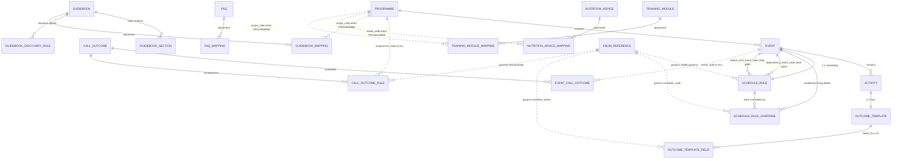

# DiNC PostgreSQL Implementation Blueprint

**Source of truth:** `DiNC_Metadata_Master_v1.8.xlsx` (FINAL frozen metadata specification — not modified by this document)
**Status:** Pre-implementation blueprint. **No SQL, no CREATE TABLE statements** — logical design only.
**Companions:** `DiNC_Runtime_Workflow_Design.md` (functional spec), Architecture_Audit §I (v1.8 sign-off).

---

## 1. Worksheet Classification

The v1.8 workbook contains **26 worksheets**: **21 become database tables**, 5 are documentation and are not implemented.

| Worksheet | Classification | Role |
|---|---|---|
| Programme | **Metadata Table** | Root of the care hierarchy (12 programmes) |
| Event | **Metadata Table** | Service contacts per programme (65) |
| Activity | **Metadata Table** | Work items per event (193) |
| Schedule_Rule | **Configuration Table** | Declarative scheduling behaviour, exactly one rule per Event (65) |
| Schedule_Rule_Override | **Configuration Table** | Conditional timing deltas over Schedule_Rule (3 HIGH_RISK rows) |
| Outcome_Template | **Metadata Table** | The "form" attached to each Activity (193, 1:1 in v1) |
| Outcome_Template_Field | **Metadata Table** | Fields on a template; carries `workflow_action` (193) |
| Call_Outcome | **Reference Table** | Call-disposition vocabulary (6) |
| Event_Call_Outcome | **Mapping Table** | Event → available outcomes, ALL-sentinel junction (6) |
| Call_Outcome_Rule | **Configuration Table** | Outcome → action/delay/priority decision table (6) |
| Guidebook | **Metadata Table** | Clinical guidebook headers (15) |
| Guidebook_Section | **Metadata Table** | Normalized guidebook bodies (45) |
| Guidebook_Discovery_Rule | **Configuration Table** | Regex signal → guidebook matching rules (15) |
| Guidebook_Mapping | **Mapping Table** | Guidebook → scope placement (16) |
| FAQ | **Metadata Table** | Platform FAQ content (27) |
| FAQ_Mapping | **Mapping Table** | FAQ → scope placement (27, all GLOBAL) |
| Nutrition_Advice | **Metadata Table** | Atomic advice lines (45) |
| Nutrition_Advice_Mapping | **Mapping Table** | Advice → scope placement (51) |
| Training_Module | **Metadata Table** | Training content (6) |
| Training_Module_Mapping | **Mapping Table** | Module → scope placement (7) |
| Enum_Reference | **Reference Table** | Controlled vocabulary for all governed coded columns (22 vocabulary rows, 7 enum groups) |
| Reference this for timeline | **Documentation** — not implemented | Original human-readable scheduling source (provenance only) |
| Change Log | **Documentation** — not implemented | Version audit trail |
| Design Review | **Documentation** — not implemented | Architect decision record A–Q |
| README | **Documentation** — not implemented | Model documentation §1–11 |
| Architecture_Audit | **Documentation** — not implemented | Audit results & sign-off |

Classification rationale: **Metadata** = defines domain structures and content; **Reference** = pure lookup vocabularies; **Mapping** = junction tables placing content into scope; **Configuration** = behavioural decision tables the engine executes against (scheduling, call consequences, discovery matching). Documentation sheets stay in the versioned workbook artifact — implementing them as tables would add no queryable value.

---

## 2. Primary Keys

All UUID keys are **deterministic UUIDv5** (namespace = `uuid5(DNS, "dinc.assam.in/metadata/structural")`), reproducible from natural keys — safe as stable PKs, no sequence generators needed for metadata.

| Table | Primary Key | Additional Uniqueness (natural keys) |
|---|---|---|
| Programme | `programme_id` | `programme_code`, `programme_name` |
| Event | `event_id` | `event_code`; (`programme_id`, `event_name`) |
| Activity | `activity_id` | `activity_code`; (`event_id`, `activity_name`) |
| Schedule_Rule | `rule_id` | `event_id` **(enforces the audited 1:1)**; `event_code` |
| Schedule_Rule_Override | `override_id` | (`event_code`, `condition_code`) **(one override per event per condition)** |
| Outcome_Template | `template_id` | `activity_id` (1:1 in v1); `activity_code` |
| Outcome_Template_Field | `field_id` | (`template_id`, `field_name`) |
| Call_Outcome | `code` (natural) | — |
| Event_Call_Outcome | composite (`event_code`, `outcome_code`) — *no surrogate in workbook* | — |
| Call_Outcome_Rule | composite (`outcome_code`, `programme_code`) — *no surrogate in workbook* | — |
| Guidebook | `guidebook_code` (natural) | — |
| Guidebook_Section | `section_id` | (`guidebook_code`, `section_type`) |
| Guidebook_Discovery_Rule | `rule_id` | — |
| Guidebook_Mapping | `mapping_id` | (`guidebook_code`, `scope_level`, `scope_code`) |
| FAQ | `faq_code` (natural) | — |
| FAQ_Mapping | `mapping_id` | (`faq_code`, `scope_level`, `scope_code`) |
| Nutrition_Advice | `advice_id` | `advice_code` |
| Nutrition_Advice_Mapping | `mapping_id` | (`advice_code`, `scope_level`, `scope_code`) |
| Training_Module | `module_code` (natural) | — |
| Training_Module_Mapping | `mapping_id` | (`module_code`, `scope_level`, `scope_code`) |
| Enum_Reference | composite (`enum_column`, `allowed_value`) | — |

Notes:
- **Dual-key convention** (Schedule_Rule, Schedule_Rule_Override carry both `event_code` and `event_id`): per Design Review §F, enforce `event_id` as the FK and treat `event_code` as a validated unique natural key. A pair-consistency check (both point at the same Event) belongs in seeding validation.
- **Enum_Reference "(null)" row**: the `condition_code | (null)` vocabulary row documents NULL semantics; it is documentation-in-data. At implementation, represent it as documentation of the column's nullability, not as a literal lookup value.

---

## 3. Foreign Keys

### 3.1 Hard foreign keys (directly enforceable)

| From | To | Note |
|---|---|---|
| Event.`programme_id` | Programme | |
| Activity.`event_id` | Event | |
| Schedule_Rule.`event_id` | Event | + UNIQUE = the 1:1 |
| Schedule_Rule.`dependency_event_code` | Event.`event_code` | nullable; start gate |
| Schedule_Rule.`repeat_until_event_code` | Event.`event_code` | nullable; stop gate (v1.8) |
| Schedule_Rule_Override.`event_id` | Event | |
| Schedule_Rule_Override.`repeat_until_event_code` | Event.`event_code` | nullable |
| Schedule_Rule_Override.`event_id` | Schedule_Rule.`event_id` | every override needs a base rule (implied by 1:1; can be made explicit) |
| Outcome_Template.`activity_id` | Activity | + UNIQUE = 1:1 in v1 |
| Outcome_Template_Field.`template_id` | Outcome_Template | |
| Event_Call_Outcome.`outcome_code` | Call_Outcome.`code` | |
| Call_Outcome_Rule.`outcome_code` | Call_Outcome.`code` | |
| Guidebook_Section.`guidebook_code` | Guidebook | |
| Guidebook_Discovery_Rule.`guidebook_code` | Guidebook | |
| Guidebook_Mapping.`guidebook_code` | Guidebook | |
| FAQ_Mapping.`faq_code` | FAQ | |
| Nutrition_Advice_Mapping.`advice_code` | Nutrition_Advice.`advice_code` | |
| Training_Module_Mapping.`module_code` | Training_Module | |

### 3.2 FK-or-sentinel columns (resolver-enforced, NOT naive FKs)

Documented in Design Review §K/§L — these columns hold either a real code **or the reserved literal `ALL`**:

| Column | References when not sentinel | Sentinel meaning |
|---|---|---|
| Event_Call_Outcome.`event_code` | Event.`event_code` | `ALL` = default outcome set for every Event; specific rows override |
| Call_Outcome_Rule.`programme_code` | Programme.`programme_code` | `ALL` = default rule for every Programme; specific rows override |
| all four `*_Mapping.scope_code` | Programme.`programme_code` when `scope_level = PROGRAMME` (Event/Activity codes when those reserved levels are used) | `ALL` when `scope_level = GLOBAL` |

Enforcement strategy (no SQL here, mechanism named only): conditional validation (trigger or constraint-with-case) plus resolver views implementing *specific-overrides-ALL*. A naive FK constraint would reject the sentinel and must not be used on these columns.

### 3.3 Enum-governed columns (lookup-enforced against Enum_Reference)

`schedule_type`, `anchor_type`, `condition_code` (Schedule_Rule + Schedule_Rule_Override), `workflow_action`, `next_action`, `priority`, `scope_level`. Per Architecture_Audit D2-2, prefer enforcement via lookup against Enum_Reference (drift-resistant, extensible by data) over hardcoded CHECK lists. Category-like columns (`Call_Outcome.category`, content `category` columns, `section_type`, `field_type`) remain candidates for the same treatment — carried recommendation, not a v1.8 change.

---

## 4. Logical Entity Relationship Diagram

Attribute-light, logical only. `||--o{` = one-to-many, `||--||` = one-to-one, dashed = sentinel/conditional reference.



*(FAQ_Mapping is all-GLOBAL in v1.8, so it has no PROGRAMME edge yet; the conditional reference exists the moment a PROGRAMME-scoped row is added.)*

---

## 5. Seed Tables (deployment-time data load)

**All 21 implemented tables are seeded from the v1.8 workbook** — every one is definitional; none starts empty. Dependency-ordered load sequence:

| Wave | Tables | Why this order |
|---|---|---|
| 1 | Enum_Reference | Governs coded columns validated in later waves |
| 2 | Programme | Hierarchy root |
| 3 | Event | Needs Programme |
| 4 | Activity, Schedule_Rule | Need Event (Schedule_Rule's dependency/repeat_until self-references within Event are satisfied — Event fully loaded) |
| 5 | Schedule_Rule_Override | Needs Event + Schedule_Rule + enum vocabulary |
| 6 | Outcome_Template | Needs Activity |
| 7 | Outcome_Template_Field | Needs Outcome_Template |
| 8 | Call_Outcome | Independent vocabulary |
| 9 | Event_Call_Outcome, Call_Outcome_Rule | Need Call_Outcome (+ sentinel validation) |
| 10 | Guidebook, FAQ, Nutrition_Advice, Training_Module | Independent content |
| 11 | Guidebook_Section, Guidebook_Discovery_Rule, all four `*_Mapping` tables | Need their content parents (+ scope validation) |

Seeding rules: the load is **idempotent and verifiable** — deterministic UUIDv5 keys mean re-seeding the same release produces identical rows; the post-seed validation must re-run the workbook audit suite (31 relationship checks, pair-consistency, sentinel validity) against the database. Record the release in a small provenance table (workbook version + file hash + load timestamp) so the running system can state which frozen specification it embodies.

---

## 6. Runtime Tables — required but deliberately absent from the workbook

Patient-state entities from Runtime Workflow Design §14, extended for v1.8 semantics. Conceptual (no columns):

| # | Runtime table | Purpose | References metadata via |
|---|---|---|---|
| 1 | **patient** | The person under care; demographics incl. birth date (BD-2) | — |
| 2 | **patient_condition** | Condition flags with timestamps (HIGH_RISK, initiation, referral, sex) — the runtime input that evaluates `condition_code` and triggers override re-resolution (BD-5) | Enum_Reference condition vocabulary |
| 3 | **programme_enrolment** | Enrolment; holds `registration_date` (the PROGRAMME_REGISTRATION anchor), status incl. exit (BD-7) | Programme |
| 4 | **event_instance** | A patient's Event; status (Locked/Active/Overdue/Completed), computed due date, completion timestamp, the *effective* resolved schedule | Event, Schedule_Rule, Schedule_Rule_Override |
| 5 | **event_occurrence** | One occurrence of a RECURRING stream (e.g. each 30-day HRP contact); termination governed by `repeat_until_event_code` / repeat_count / exit (BD-8) | Schedule_Rule (+ override) |
| 6 | **activity_instance** | A patient's Activity; status, completion timestamp | Activity |
| 7 | **outcome_response** | Recorded answers to template fields, incl. "Not Completed" attempts if BD-6 confirms | Outcome_Template_Field |
| 8 | **call_log** | Call attempts + selected disposition | Call_Outcome |
| 9 | **followup_task** | Task raised by CREATE_FOLLOWUP; due date, priority, status (BD-9) | Call_Outcome_Rule |
| 10 | **care_manager / app_user** *(operational)* | Who acts; assignment of worklists | — |
| 11 | **audit_log** *(operational)* | Who did what when — required for a clinical system even though the metadata model omits audit columns by design (Audit D3-1) | — |

Runtime status vocabularies (Pending/Overdue/Locked/…) are **runtime enums, not Enum_Reference rows** — the audit explicitly verified the metadata holds no runtime state, and that boundary carries into the database.

---

## 7. Metadata vs Runtime Separation

| | Metadata (21 tables) | Runtime (§6 tables) |
|---|---|---|
| Contents | Definitions: hierarchy, schedules, overrides, forms, policies, content | Patient state: instances, statuses, timestamps, responses, tasks |
| Mutability | **Read-only in production**; changes only via a new workbook release + re-seed migration | Read-write, continuous |
| Keys | Deterministic UUIDv5 from the workbook | Generated at runtime (random UUIDs or sequences) |
| Volume | Fixed per release (~1,000 rows total) | Grows with patients |
| Lifecycle | Versioned with the metadata release (v1.8 → v1.9…) | Independent migrations; survives metadata upgrades |
| Coupling rule | — | References metadata **only by stable code/UUID; never copies** offsets, text, or definitions |

The four sub-engines (Progression, Schedule, Call, Knowledge) read the left column and write the right column — never the reverse.

---

## 8. Recommended Schema Organization

**Two PostgreSQL schemas within one database, plus views:**

```
dinc_metadata   — the 21 seeded tables + resolver views (read-only to the application)
dinc_runtime    — patient-state tables (application read-write)
```

**Justification:**

1. **The privilege boundary enforces the architecture.** The entire design rests on "the runtime reads metadata and writes patient state." With separate schemas this stops being a convention and becomes a grant: the application role gets SELECT-only on `dinc_metadata` and full DML on `dinc_runtime`. The frozen specification physically cannot drift in production.
2. **Independent lifecycles.** Metadata changes arrive as versioned releases (workbook → seed migration, validated by the audit suite); runtime tables evolve by ordinary migrations. Separate schemas keep the two migration histories, backup cadences, and restore procedures cleanly apart — restoring patient data never risks reverting the specification, and vice versa.
3. **The resolver layer lives with the data it resolves.** The specific-overrides-ALL resolvers (Event_Call_Outcome, Call_Outcome_Rule) and the Schedule_Rule + Override coalescing resolver (README §10) belong in `dinc_metadata` as views: every consumer — engine, reporting, future services — reads one canonical resolution instead of re-implementing precedence. Sentinel and conditional-scope validation (the not-naive-FK cases from §3.2) also attach here.
4. **One database, not two.** Runtime rows FK onto metadata keys (event_instance → Event, etc.); cross-database foreign keys don't exist in PostgreSQL, and dropping those FKs would sacrifice exactly the referential integrity the audit certified. Schemas give the separation without losing enforcement.
5. **Mirrors the mental model.** A developer, DBA, or auditor sees the frozen-vs-mutable boundary in every fully-qualified table name — the same two-world table that opens the Runtime Workflow Design document.

**Implementation cautions carried forward from the audit/design record** (mechanisms named, no SQL):
- NULL is semantically meaningful (open-ended `repeat_count`, unconditional `condition_code`, no-offset `offset_days`, no-terminator `repeat_until_event_code`) — do not add NOT NULL defaults that erase it.
- Enforce the audited invariants as database constraints where cheap (RECURRING ⇒ interval; SCHEDULE_DRIVEN ⇒ reference_source; PREVIOUS_EVENT_COMPLETION ⇒ dependency; override uniqueness) and in the seed validator where they span tables.
- Do not add status/date columns to metadata tables; they belong to `dinc_runtime`.
- Code-style harmonisation (GB0nn/TM0nn vs hyphenated) remains the deferred cosmetic item from Audit D2-1 — joins use stored codes exactly, so it is safe to defer again.

---

## Next step after this blueprint

Physical design: column-level DDL specification per table (types, constraints, indexes), the resolver-view definitions, the seed loader with the 31-check validation gate, and the runtime table detail — each of which requires the still-open business decisions BD-1…BD-11 (minus those v1.8 resolved) to be closed first. None of that is started here, per scope.

*Produced from the frozen v1.8 workbook. No SQL generated; no workbook modification.*
