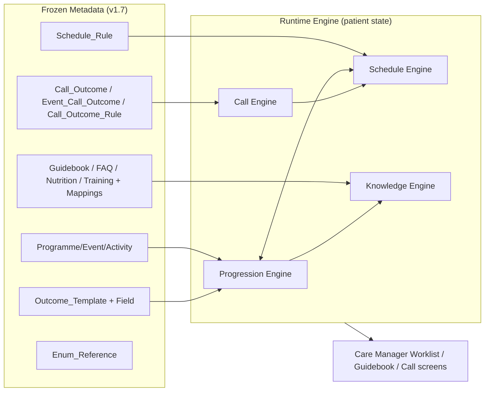
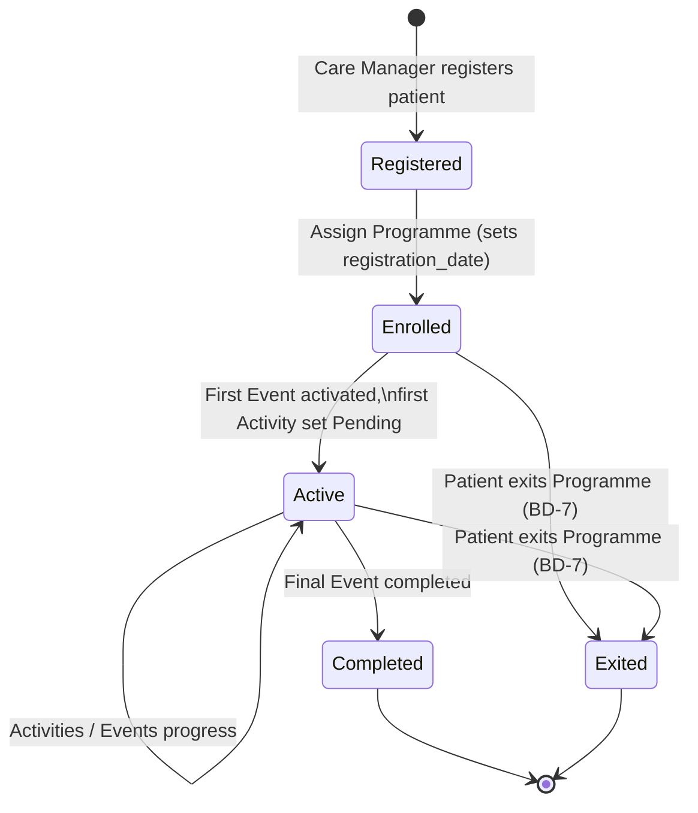
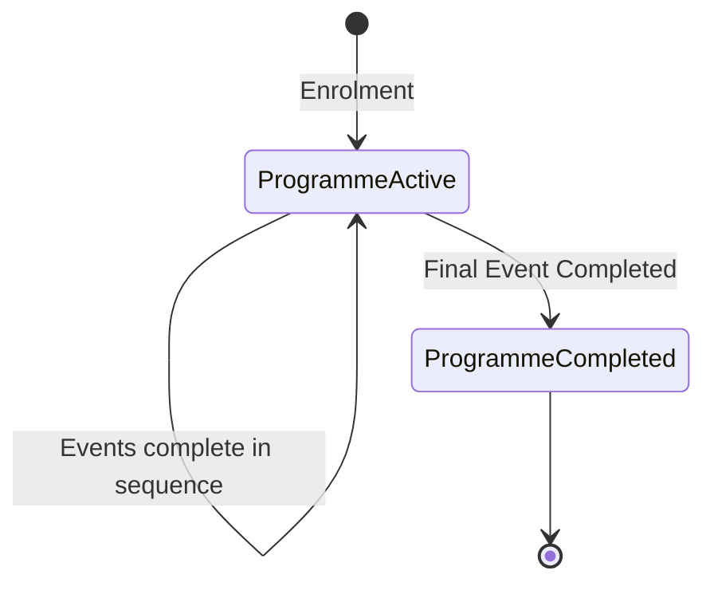
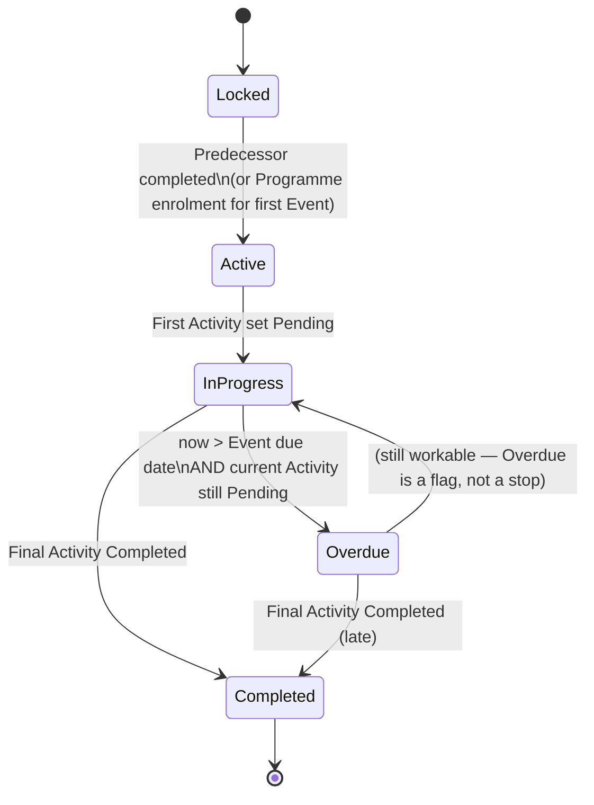
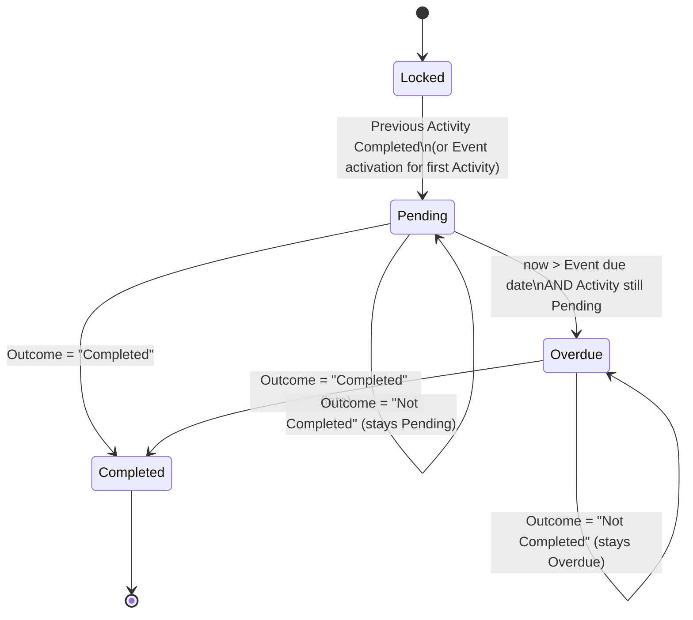
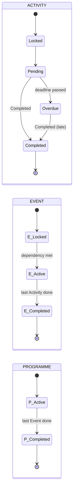
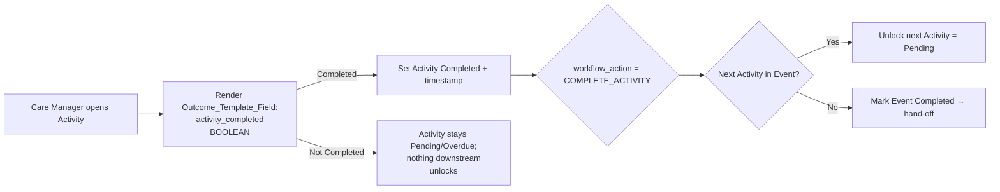
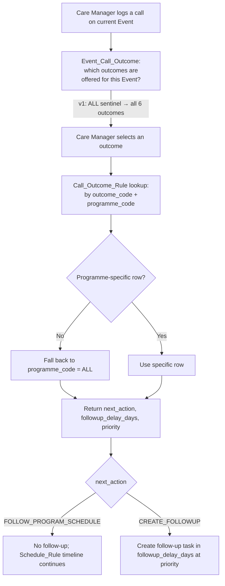
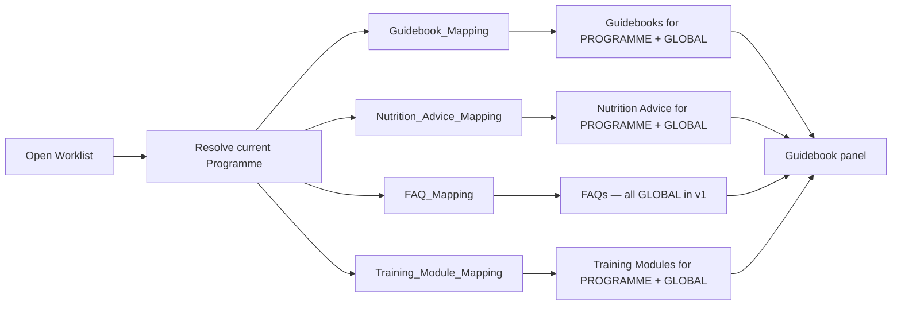
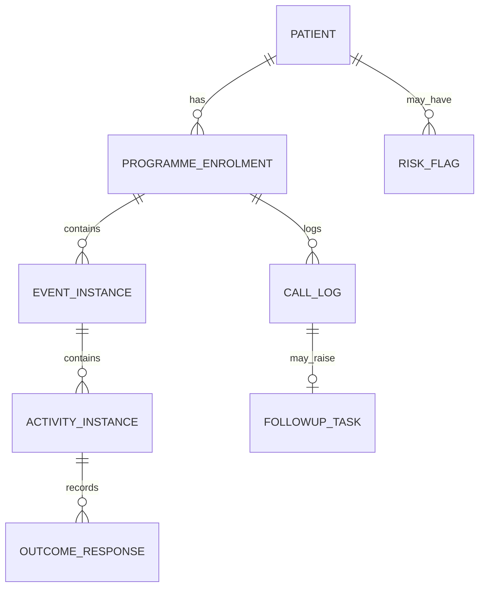

# DiNC Runtime Workflow Design
### Functional Specification for the DiNC Care-Management Runtime Engine
**Source of truth:** `DiNC_Metadata_Master_v1.7_Audit_done.xlsx` (metadata only — not modified by this document)
**Status:** Functional design for review, ahead of PostgreSQL runtime implementation
**Scope note:** Everything below is *grounded in the existing metadata*. Where the metadata does not define a rule, it is called out explicitly as a **Business Decision (BD-n)** in Section 15 rather than assumed.

---

## 1. Overall Runtime Architecture

The DiNC runtime is a **metadata-driven state machine**. It holds no hardcoded clinical logic: every timeline, progression rule, follow-up consequence, and piece of on-screen knowledge is *read* from the frozen metadata workbook. The runtime's only job is to (a) hold **patient-specific state**, and (b) apply the metadata to move that state forward.

Two worlds are kept strictly separate:

| Layer | Owns | Examples | Mutable at runtime? |
|---|---|---|---|
| **Metadata (frozen spec)** | Definitions | Programme→Event→Activity, Schedule_Rule, Outcome_Template(_Field), Call_Outcome(_Rule), Guidebook/FAQ/Nutrition/Training + mappings, Enum_Reference | No (versioned) |
| **Runtime (this design)** | Patient state | Which programme a patient is enrolled in, which event/activity is Active/Pending/Completed/Overdue, timestamps, follow-up tasks | Yes |

The engine is composed of four cooperating sub-engines, all reading the same metadata:

1. **Progression Engine** — advances Activities → Events → Programme using Outcome Template results.
2. **Schedule Engine** — computes due dates and the Pending/Overdue distinction from `Schedule_Rule`; activates the next Event.
3. **Call Engine** — turns a recorded call outcome into a next action, follow-up delay, and priority via the Call_Outcome cluster.
4. **Knowledge Engine** — resolves the Guidebooks/FAQ/Nutrition/Training to show for the patient's current context via the `*_Mapping` scope model.

**Design principle:** the runtime *reads* metadata and *writes* patient state. It never writes metadata, and it never contains a timeline or rule that isn't in the metadata.

---

## 2. Patient Lifecycle

The lifecycle begins at registration and is always anchored to a **Programme enrolment** (a patient may be enrolled in one or more programmes — see **BD-1** on concurrency).

**Registration is the temporal origin.** The `registration_date` captured at enrolment is the value the Schedule Engine uses wherever `anchor_type = PROGRAMME_REGISTRATION` (36 of 65 events). For immunization-style events (`anchor_type = BIRTH_DATE`, 22 events), the engine additionally needs the patient's **date of birth** (see **BD-2** — birth date is required input the metadata assumes but does not itself hold).

---

## 3. Programme Lifecycle

On enrolment the Programme becomes **Active**. Per the business rules:
- The Programme's **first Event** (lowest `display_order` within the programme) is activated automatically.
- When the **final Event** of the Programme is Completed, the Programme is marked **Completed** and **no Event remains Active**.

**Grounding & caveat:** "first Event" and "final Event" are read from `Event.display_order` within the programme. However, the metadata models each programme as a **dependency graph, not a single line** — see Section 4 and **BD-3**. "Final Event" is unambiguous only if the programme reduces to one terminal event; where a programme has parallel/independent streams, "the Programme is complete when its final Event completes" needs the completion predicate in **BD-3**.

---

## 4. Event Lifecycle

An Event is activated, its activities are worked through in order, and on completion it hands off to the next Event as the Schedule metadata dictates.

**Activation.** An Event becomes **Active** when its predecessor completes. The predecessor is defined by `Schedule_Rule.dependency_event_code`. On activation:
- The Event's **due date** is computed by the Schedule Engine (Section 7).
- The Event's **first Activity** (lowest `display_order`) becomes **Pending**; all other Activities are **Locked**.

**Completion & hand-off.** When the Event's final Activity is Completed, the Event is marked **Completed** and the engine **immediately activates the next Event** whose `dependency_event_code` points at the just-completed Event. Constraints from the brief:
- **No duplicate Events** — each Event instance is created once per patient enrolment.
- **No overlap of sequential Events** unless the metadata explicitly permits it. In the metadata, "explicit permission" = events that are *not* chained by `dependency_event_code` (e.g. `anchor_type = BIRTH_DATE` immunization sessions, or independent `PROGRAMME_REGISTRATION` recurring streams) and may legitimately be Active concurrently. Strictly-chained events (`anchor = PREVIOUS_EVENT_COMPLETION`) never overlap. See **BD-3/BD-4**.

**Conditional events.** Two events in PRG-001 (EVT-005 PMSMA, EVT-006 HRP) carry `condition_code = HIGH_RISK` and depend on EVT-002. These activate **only if** the patient meets the condition. The metadata declares the condition token; the *evaluation input* (is this patient high-risk?) is runtime data the metadata does not supply — see **BD-5**.

---

## 5. Activity Lifecycle

Activities within an Event are strictly linear by `display_order`, gated by the single Outcome Template field.

Each Activity has exactly one `Outcome_Template`, which in v1 has exactly one `Outcome_Template_Field`: `field_name = activity_completed`, `field_type = BOOLEAN`, rendered as **Completed / Not Completed**, carrying `workflow_action = COMPLETE_ACTIVITY`.

**On "Completed":**
1. Mark Activity **Completed** and record a completion timestamp.
2. Apply `workflow_action = COMPLETE_ACTIVITY` → unlock the **next Activity** (next `display_order`) as **Pending**.
3. If there is **no next Activity**, mark the **Event Completed** (triggers Section 4 hand-off).

**On "Not Completed":**
- The Activity **remains Pending** (or Overdue if the deadline has passed). **No later Activity may start.** The workflow does not skip. (The BOOLEAN records *not-yet-complete*; it is not a terminal "failed" state — see **BD-6** on whether "Not Completed" should be persisted as an attempt/observation.)

---

## 6. State Transition Diagrams (consolidated)

**Status vocabulary** (runtime-only; deliberately absent from metadata per the audit): `Locked`, `Pending`, `Active` (Event), `Overdue`, `Completed`, plus Programme `Completed`/`Exited`.

**Cascade summary:** `Activity.Completed` (last in Event) → `Event.Completed` → activate next Event → `Event.Completed` (last in Programme) → `Programme.Completed`. Overdue is an **orthogonal flag** on a Pending Activity/Event; it changes urgency and reporting, never the path.

---

## 7. How Schedule_Rule Drives the Engine

`Schedule_Rule` holds exactly one rule per Event and is the **only** source of timing. Relevant columns: `schedule_type`, `anchor_type`, `offset_days`, `repeat_interval_days`, `repeat_count`, `dependency_event_code`, `condition_code`, `reference_source`.

### 7.1 Due-date calculation

The engine computes an Event's due date from its **anchor** plus **offset**:

| `anchor_type` | Anchor timestamp the engine supplies | Due date |
|---|---|---|
| `PROGRAMME_REGISTRATION` (36) | `registration_date` | `registration_date + offset_days` |
| `PREVIOUS_EVENT_COMPLETION` (7) | completion timestamp of `dependency_event_code` | `prev_completion + offset_days` |
| `BIRTH_DATE` (22) | patient date of birth (**BD-2**) | `birth_date + offset_days` |

By `schedule_type`:
- **ONE_TIME (9):** single due date as above.
- **SCHEDULE_DRIVEN (19):** single due date from `BIRTH_DATE + offset_days` (immunization ages); `reference_source` cites the IMA schedule.
- **RECURRING (37):** first occurrence at `anchor + offset_days` (offset 0 = at anchor), then each subsequent occurrence at `+ repeat_interval_days`, up to `repeat_count` (NULL = open-ended). See **BD-8** on how recurring occurrences are instantiated as workable items.

`offset_days = NULL` (EVT-005/006) means the source gave no numeric offset; those events have no engine-computed due date and rely on their `HIGH_RISK` condition + manual scheduling (**BD-5**).

### 7.2 Pending vs Overdue

The Schedule Engine runs continuously (or on read). For the **current Pending Activity** of an Active Event:
- `now <= due_date` → **Pending**.
- `now > due_date` and Activity still not Completed → **Overdue**.

Because the schedule lives at **Event** level, the Event due date governs the *current* Activity's Overdue flag (activities have no independent schedule). Overdue never advances the workflow — the same Activity must still be completed.

### 7.3 Next-Event activation

On Event completion, the engine finds the Event(s) whose `dependency_event_code` = the completed Event, activates them, and computes their due dates (usually `PREVIOUS_EVENT_COMPLETION + offset_days`). Events with **no** dependency are independent streams; **BD-3/BD-4** define when they activate (at enrolment vs on demand).

---

## 8. How Outcome Templates Drive Progression

The Outcome Template is the **only** mechanism that advances a patient. It is metadata-declared, not code:

The engine reads `workflow_action` rather than hardcoding "complete the activity." Today the only value is `COMPLETE_ACTIVITY`; because it is a governed enum, future actions (e.g. `COMPLETE_EVENT`, `TRIGGER_REFERRAL`) can drive different progression **without engine changes** — the engine switches on the value it reads.

**One field today, many tomorrow.** `Outcome_Template_Field` is already a one-to-many table (one row per template in v1). When richer outcome capture is added (BP, weight, referral outcome), the *completion* semantics stay tied to the field carrying `workflow_action = COMPLETE_ACTIVITY`; other fields are data capture. See **BD-6**.

---

## 9. How Call Outcomes Trigger Follow-up

A call disposition is resolved through the three-table cluster, all metadata:

Grounded values (v1, all `programme_code = ALL`):

| outcome | next_action | delay (days) | priority |
|---|---|---|---|
| SUCCESS | FOLLOW_PROGRAM_SCHEDULE | — | NORMAL |
| NIL | CREATE_FOLLOWUP | 7 | HIGH |
| CALLBACK | CREATE_FOLLOWUP | 3 | NORMAL |
| VOICE | CREATE_FOLLOWUP | 5 | NORMAL |
| BUSY | CREATE_FOLLOWUP | 1 | HIGH |
| HOSPITAL | CREATE_FOLLOWUP | 14 | URGENT |

`Event_Call_Outcome` (availability) and `Call_Outcome_Rule` (consequence) both use the **ALL sentinel** with a *specific-overrides-ALL* resolver. **What a "follow-up task" is** (a new worklist item type, its relationship to the pending Activity, whether it blocks progression) is **not defined in the metadata → BD-9.** `FOLLOW_PROGRAM_SCHEDULE` explicitly means "do nothing special; the existing Schedule_Rule timeline stays in force."

---

## 10–12. How Guidebooks, Nutrition Advice & FAQs Are Automatically Selected

All knowledge content resolves through the **generic scope model** (`scope_level` + `scope_code`) in the four `*_Mapping` tables — no hardcoded frontend mapping. When the Care Manager opens a patient's Worklist, the Knowledge Engine:

1. Determines the patient's **current context**: Programme (from enrolment), current Event, current Activity (from progression state).
2. Runs a single resolution rule per content type:

> **Show content whose mapping is `(scope_level = PROGRAMME AND scope_code = current programme_code)` OR `(scope_level = GLOBAL)`, filtered by `is_active`, ordered by `display_order`.**

**Per content type, grounded in v1 data:**
- **Guidebooks (§10):** `Guidebook_Mapping` resolves to the current Programme (e.g. PRG-001 → the maternal guidebooks) plus GLOBAL. Guidebook bodies come from `Guidebook_Section`. Free-text/AI search additionally resolves via `Guidebook_Discovery_Rule` (regex `pattern → guidebook_code`) — the *discovery* path, complementary to this *placement* path.
- **Nutrition Advice (§11):** `Nutrition_Advice_Mapping` → current Programme + GLOBAL. (CHILD advice maps to both PRG-002 and PRG-003, so a child-health patient sees the shared set.)
- **FAQs (§12):** all FAQ mappings are **GLOBAL** in v1, so the full active FAQ set is offered regardless of programme. If programme-specific FAQs are wanted later, add PROGRAMME-scoped mapping rows — no schema change.

**Scope-model headroom:** because `scope_level` already governs `EVENT` and `ACTIVITY`, the *same* resolution rule extends to Event- or Activity-specific content by adding `(scope_level = EVENT, scope_code = current event)` / `(ACTIVITY, current activity)` to the OR — with no engine or schema change. None exists in v1 (nothing is authored below Programme level).

---

## 13. Edge Cases

Each is traced through the metadata + business rules above.

### 13.1 Patient misses ANC 1 (EVT-001)
- EVT-001 is `ONE_TIME`, `anchor = PROGRAMME_REGISTRATION`, `offset_days = 90`. Its first Activity (ACT-001, pregnancy registration) is Pending from enrolment.
- If `now > registration_date + 90` and ACT-001 is still not Completed → Activity/Event becomes **Overdue**.
- **Overdue does not skip.** ACT-001 stays the active task; no downstream Activity or Event (EVT-002 ANC 2, which depends on EVT-001) can start. The patient is "stuck at ANC 1, overdue" until it is completed — exactly the intended safety behaviour.

### 13.2 Patient completes an overdue Activity
- Care Manager records **Completed** on the overdue Activity.
- Engine sets it **Completed** + timestamp (the completion is simply *late*; the timestamp captures actual date).
- `workflow_action = COMPLETE_ACTIVITY` fires normally: next Activity unlocks, or the Event completes and hands off.
- **Downstream due dates recompute from the *actual* completion.** Because the next Event's anchor is typically `PREVIOUS_EVENT_COMPLETION`, a late completion shifts the whole downstream chain later — the schedule self-heals from real dates rather than original plan. (Confirm this is desired vs. anchoring to the original planned date — **BD-10**.)

### 13.3 Patient completes the final Event
- Last Activity of the last Event → Event **Completed** → engine finds no further dependent Event in the Programme → **Programme Completed**, no Event remains Active (Section 3).
- "Last Event" resolution depends on **BD-3** where a programme has parallel streams.

### 13.4 Patient exits the Programme (withdrawal / transfer / death / loss-to-follow-up)
- **Not defined in metadata.** There is no exit/withdrawal concept in the workbook. This is **BD-7**: define exit reasons, whether in-flight Events are cancelled vs frozen, and whether exit is reversible. The lifecycle diagram (Section 2) reserves an `Exited` terminal state pending that decision.

### 13.5 Additional edge cases surfaced by the metadata (not in the brief, flagged for completeness)
- **Conditional branch never triggers:** EVT-005/006 (HIGH_RISK) — if the patient is not high-risk, these Events should be skipped/never activated. The engine needs the risk input (**BD-5**) and a rule for "conditional event not applicable."
- **Recurring event with open-ended `repeat_count = NULL`:** e.g. 6-monthly rounds — when does the stream *end*? Presumably at Programme completion or exit; needs a stop rule (**BD-8**).
- **Independent streams & Programme completion:** if 38 dependency-less events can be Active in parallel, "Programme complete" must mean *all* required streams complete — define "required" vs "optional/on-referral" (**BD-3**).
- **ON_REFERRAL events (EVT-038/040):** carried from earlier iterations as on-demand with no schedule; they activate only when a referral is raised (**BD-11**, previously flagged).

---

## 14. Recommended Runtime Database Entities (conceptual only — no SQL, no columns)

These are the **patient-state** entities the runtime needs. They are deliberately separate from metadata; each *references* metadata by its stable code/UUID but stores no copy of it. **Conceptual only** — no fields defined here.

| # | Runtime entity | Purpose | References metadata |
|---|---|---|---|
| 1 | **Patient** | The person under care | — |
| 2 | **Programme_Enrolment** | A patient's enrolment into a programme; holds registration_date, birth_date, status | Programme |
| 3 | **Event_Instance** | A patient's instance of an Event; holds status (Locked/Active/Overdue/Completed), computed due date, completion timestamp | Event, Schedule_Rule |
| 4 | **Activity_Instance** | A patient's instance of an Activity; holds status (Locked/Pending/Overdue/Completed), completion timestamp | Activity |
| 5 | **Outcome_Response** | The recorded answer(s) to an Activity's Outcome Template | Outcome_Template(_Field) |
| 6 | **Call_Log** | A recorded call attempt and its selected outcome | Call_Outcome |
| 7 | **Followup_Task** | A task raised by a CREATE_FOLLOWUP rule; holds due date, priority, status | Call_Outcome_Rule |
| 8 | **Risk_Flag / Patient_Attribute** *(if BD-5 confirms)* | Runtime inputs that evaluate `condition_code` (e.g. high-risk, sex) | Enum_Reference (condition_code) |

Relationships (conceptual): `Patient 1—* Programme_Enrolment 1—* Event_Instance 1—* Activity_Instance 1—* Outcome_Response`; `Programme_Enrolment 1—* Call_Log 1—0..1 Followup_Task`.

**Metadata is read-only to all of the above.** No runtime entity duplicates guidebook text, schedule offsets, or outcome definitions — they hold foreign references to the frozen codes/UUIDs.

---

## 15. Business-Rule Ambiguities to Clarify Before PostgreSQL Implementation

These are points where **the metadata does not define a rule**. Per the brief, they are surfaced as explicit business decisions — **none has been assumed**. Ordered by implementation impact.

| ID | Ambiguity | Why it matters | Options to decide between |
|---|---|---|---|
| **BD-1** | **Concurrent programmes per patient.** | A patient may plausibly be in Maternal + NCD simultaneously. The engine must know if enrolments are independent parallel state machines. | (a) One active programme at a time; (b) many concurrent enrolments (recommended — entities in §14 already support it). |
| **BD-2** | **Birth date source.** | 22 events use `anchor = BIRTH_DATE`; the metadata assumes a birth date it does not store. | Capture birth_date on the relevant enrolment (child programmes); define behaviour if unknown. |
| **BD-3** | **Linear chain vs dependency graph within a Programme.** | Metadata is a graph: linear ANC spine **plus** conditional branches (EVT-005/006) **plus** 38 dependency-less independent streams. The brief's "activate the next Event" assumes a single line. "Programme complete" is undefined for parallel streams. | (a) Force strict linear-by-display_order (simplest, but ignores dependencies/branches); (b) honour the dependency graph and define "Programme complete = all *required* streams complete" (recommended; requires BD-4). |
| **BD-4** | **When do dependency-less (independent) events activate?** | 38 events have no `dependency_event_code` (recurring service streams, immunization sessions). | (a) All activate at enrolment; (b) activate on their own anchor/schedule; (c) activate on demand. Interacts with "no overlap unless metadata permits." |
| **BD-5** | **Condition evaluation inputs.** | `condition_code` (HIGH_RISK, FEMALE_ONLY, IF_INITIATED, IF_INDICATED, ON_REFERRAL) is declared, but the *patient facts* that satisfy it are runtime inputs the metadata lacks. | Define where risk/sex/initiation flags are captured and how each token is evaluated; define "conditional event not applicable" handling. |
| **BD-6** | **Persisting "Not Completed".** | The BOOLEAN keeps the Activity Pending, but should each "Not Completed" be stored as an attempt/observation (for audit, and for the call-follow-up trail)? | (a) Transient (no record); (b) recorded as an Outcome_Response attempt (recommended for auditability). |
| **BD-7** | **Programme exit / withdrawal.** | No exit concept exists in metadata. Needed for withdrawal, transfer, death, loss-to-follow-up. | Define exit reasons; whether in-flight Events cancel vs freeze; reversibility. |
| **BD-8** | **Recurring stream instantiation & termination.** | 37 RECURRING events: how are occurrences materialised as workable Activity/Event instances, and when does an open-ended (`repeat_count = NULL`) stream stop? | Define occurrence-generation (lazy vs eager) and a stop rule (at Programme completion/exit). |
| **BD-9** | **"Follow-up task" definition.** | `CREATE_FOLLOWUP` yields delay + priority, but the *nature* of the task is undefined. | Define Followup_Task: is it a new worklist item, does it attach to the pending Activity, does it block progression, who is it assigned to? |
| **BD-10** | **Late-completion re-anchoring.** | For `PREVIOUS_EVENT_COMPLETION` anchors, a late completion shifts the downstream chain. Is that intended, or should downstream anchor to the *planned* date? | (a) Re-anchor to actual completion (schedule self-heals — recommended, matches anchor semantics); (b) anchor to original plan (fixed calendar). |
| **BD-11** | **ON_REFERRAL events (EVT-038, EVT-040).** | Carried as on-demand placeholders with no schedule (flagged in prior audits). | Confirm activation trigger (a referral action) and whether they participate in Programme-completion. |
| **BD-12** | **ANC offset reading.** | Previously flagged: whether `offset_days` on an event means "this event due X days after anchor" (as modelled) or "X days to the next visit." Affects due-date maths. | Confirm the modelled reading (this-event offset) or adjust. |

**Recommended pre-implementation sequence:** resolve **BD-3/BD-4** first (they define the core progression topology), then **BD-1/BD-5** (enrolment & conditions), then **BD-9** (follow-up task), then the remainder.

---

## Closing summary

The DiNC runtime is a thin, metadata-driven state machine over patient state. Every timeline, progression step, follow-up consequence, and piece of on-screen knowledge is **read** from the frozen v1.7 metadata — the engine adds only patient state and the mechanics of applying the metadata to it. The four sub-engines (Progression, Schedule, Call, Knowledge) each map cleanly onto specific metadata clusters, and the generic scope model plus governed enums mean the engine can absorb new programmes, events, content, outcomes, and even Event-/Activity-level knowledge **without code or schema change**.

The design is complete and internally consistent **for the linear happy path the brief specifies**. The twelve business decisions in Section 15 are the gaps where the metadata is intentionally silent; they should be settled before the PostgreSQL runtime tables and workflow engine are built, since several (notably BD-3/BD-4) determine the core progression topology rather than mere details.

*No metadata was modified in producing this document. No SQL, schema, or runtime tables were generated — this is the functional specification that will drive their implementation.*
